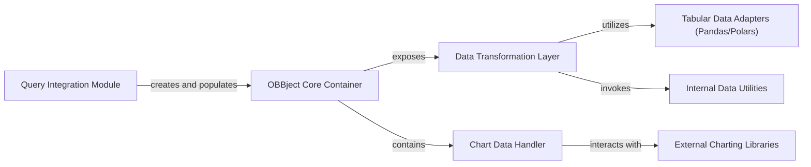

## Component Details

The `OBBject Data Model` subsystem is centered around the `OBBject` class, serving as the universal data container for all command outputs within the OpenBB Platform. Its primary purpose is to provide a consistent, structured format for diverse data types (results, warnings, charts, metadata) and to offer versatile methods for data transformation into various user-friendly formats. This overview focuses on its structure, flow, and purpose, with a detailed breakdown of its fundamental components and their interactions.

### OBBject Core Container
The foundational component, represented by the `openbb_platform.core.openbb_core.app.model.obbject.OBBject` class. It acts as the primary wrapper for all data returned by OpenBB commands, holding `results`, `warnings`, `chart` information, and `extra` metadata. Its purpose is to standardize the output structure across the platform.

**Related Classes/Methods**:

- <a href="https://github.com/OpenBB-finance/OpenBB/blob/master/openbb_platform/core/openbb_core/app/model/obbject.py#L41-L386" target="_blank" rel="noopener noreferrer">`openbb_platform.core.openbb_core.app.model.obbject.OBBject` (41:386)</a>

### Data Transformation Layer
This component encompasses the various methods within the `OBBject` class (e.g., `to_dataframe`, `to_polars`, `to_numpy`, `to_dict`, `to_llm`). Its responsibility is to convert the `OBBject`'s internal `results` into different data structures and formats, catering to diverse analytical and display needs.

**Related Classes/Methods**:

- <a href="https://github.com/OpenBB-finance/OpenBB/blob/master/openbb_platform/core/openbb_core/app/model/obbject.py#L126-L291" target="_blank" rel="noopener noreferrer">`openbb_platform.core.openbb_core.app.model.obbject.OBBject:to_dataframe` (126:291)</a>
- <a href="https://github.com/OpenBB-finance/OpenBB/blob/master/openbb_platform/core/openbb_core/app/model/obbject.py#L293-L302" target="_blank" rel="noopener noreferrer">`openbb_platform.core.openbb_core.app.model.obbject.OBBject:to_polars` (293:302)</a>
- <a href="https://github.com/OpenBB-finance/OpenBB/blob/master/openbb_platform/core/openbb_core/app/model/obbject.py#L308-L339" target="_blank" rel="noopener noreferrer">`openbb_platform.core.openbb_core.app.model.obbject.OBBject:to_dict` (308:339)</a>

### Query Integration Module
Represented by the `OBBject.from_query` class method, this component is responsible for initiating data retrieval. It takes a `Query` object, executes it asynchronously to fetch raw results, and then constructs a new `OBBject` instance, populating it with the retrieved data and any associated metadata.

**Related Classes/Methods**:

- <a href="https://github.com/OpenBB-finance/OpenBB/blob/master/openbb_platform/core/openbb_core/app/model/obbject.py#L368-L386" target="_blank" rel="noopener noreferrer">`openbb_platform.core.openbb_core.app.model.obbject.OBBject:from_query` (368:386)</a>

### Chart Data Handler
This component manages the `chart` attribute within `OBBject` and provides the `show` method. It stores serialized chart information and enables the display of visual representations of the data, integrating with an external charting library.

**Related Classes/Methods**:

- <a href="https://github.com/OpenBB-finance/OpenBB/blob/master/openbb_platform/core/openbb_core/app/model/obbject.py#L0-L0" target="_blank" rel="noopener noreferrer">`openbb_platform.core.openbb_core.app.model.obbject.OBBject:chart` (0:0)</a>
- <a href="https://github.com/OpenBB-finance/OpenBB/blob/master/openbb_platform/core/openbb_core/app/model/obbject.py#L359-L365" target="_blank" rel="noopener noreferrer">`openbb_platform.core.openbb_core.app.model.obbject.OBBject:show` (359:365)</a>

### Tabular Data Adapters (Pandas/Polars)
This component represents the direct utilization of external Python libraries, specifically Pandas and Polars, for efficient tabular data manipulation. The `Data Transformation Layer` heavily relies on these libraries to convert various data formats into DataFrames.

**Related Classes/Methods**:

- `pandas.DataFrame` (0:0)
- `polars.DataFrame` (0:0)

### Internal Data Utilities
This component includes helper functions, such as `basemodel_to_df` from `openbb_core.app.utils`, which are invoked by the `Data Transformation Layer`. These utilities provide specialized logic for converting OpenBB-specific internal data structures (e.g., lists of Pydantic `BaseModel` instances) into a format suitable for DataFrame creation.

**Related Classes/Methods**:

- <a href="https://github.com/OpenBB-finance/OpenBB/blob/master/openbb_platform/core/openbb_core/app/utils.py#L19-L57" target="_blank" rel="noopener noreferrer">`openbb_core.app.utils.basemodel_to_df` (19:57)</a>

### External Charting Libraries
External libraries used by the Chart Data Handler to display visual representations of data.

**Related Classes/Methods**: _None_

### [FAQ](https://github.com/CodeBoarding/GeneratedOnBoardings/tree/main?tab=readme-ov-file#faq)