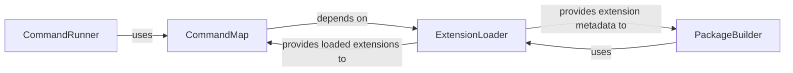

## Component Details

The `Platform Command Engine` subsystem is the heart of the OpenBB Platform's execution capabilities. It orchestrates the discovery, registration, and execution of all commands, ensuring a seamless interface between user requests and underlying functionalities. The four fundamental components identified are `CommandRunner`, `CommandMap`, `ExtensionLoader`, and `PackageBuilder`. They are chosen for their critical roles in the command lifecycle: `ExtensionLoader` enables modularity by loading extensions, `CommandMap` provides the routing mechanism, `CommandRunner` is the central execution unit, and `PackageBuilder` ensures a stable, static representation of the platform's command structure.

### CommandRunner
The `CommandRunner` is the primary execution component. It initializes with a `CommandMap`, `SystemSettings`, and `UserSettings` to provide the necessary context for command execution. It is responsible for taking user-requested command routes, resolving them via the `CommandMap`, and executing the corresponding underlying functions asynchronously or synchronously. It acts as the orchestrator for command invocation.

**Related Classes/Methods**:

- <a href="https://github.com/OpenBB-finance/OpenBB/blob/master/openbb_platform/core/openbb_core/app/command_runner.py#L431-L511" target="_blank" rel="noopener noreferrer">`openbb_core.app.command_runner.CommandRunner` (431:511)</a>

### CommandMap
This component serves as the central registry and routing mechanism for all available commands. It maps user-facing command routes to their corresponding executable functions. The `CommandMap` is populated by discovering commands from loaded extensions and provides functionalities to understand the coverage of providers and commands within the system, enabling efficient lookup and dispatch.

**Related Classes/Methods**:

- <a href="https://github.com/OpenBB-finance/OpenBB/blob/master/openbb_platform/core/openbb_core/app/router.py#L359-L494" target="_blank" rel="noopener noreferrer">`openbb_core.app.router.CommandMap` (359:494)</a>

### ExtensionLoader
The `ExtensionLoader` is responsible for discovering, loading, and managing various types of extensions (obbject, core, and provider) into the OpenBB Platform. It identifies entry points for these extensions, making their commands and functionalities available for other components like `CommandMap` and `PackageBuilder` to utilize. It is crucial for the platform's extensibility and modularity.

**Related Classes/Methods**:

- <a href="https://github.com/OpenBB-finance/OpenBB/blob/master/openbb_platform/core/openbb_core/app/extension_loader.py#L32-L176" target="_blank" rel="noopener noreferrer">`openbb_core.app.extension_loader.ExtensionLoader` (32:176)</a>

### PackageBuilder
This component is responsible for building and managing the OpenBB Platform's static extension package and command structure. It handles tasks such as cleaning previous builds, saving modules, creating the package structure, and generating reference files. It leverages information about discovered extensions to construct the platform's static representation, which can be used for documentation, auto-completion, and optimized loading.

**Related Classes/Methods**:

- <a href="https://github.com/OpenBB-finance/OpenBB/blob/master/openbb_platform/core/openbb_core/app/static/package_builder.py#L82-L280" target="_blank" rel="noopener noreferrer">`openbb_core.app.static.package_builder.PackageBuilder` (82:280)</a>

### [FAQ](https://github.com/CodeBoarding/GeneratedOnBoardings/tree/main?tab=readme-ov-file#faq)