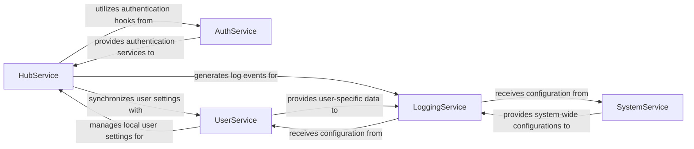

## Component Details

The `User & System Services` subsystem is a critical part of the OpenBB Platform, providing foundational capabilities for user interaction, application configuration, and operational monitoring.

### HubService
This component is the primary interface for interacting with the OpenBB Hub. It facilitates user authentication (login/logout), synchronizes user settings (credentials and defaults) between the local platform and the Hub, and handles data format conversions for backward compatibility. It acts as a gateway for all cloud-related operations, ensuring seamless integration with the OpenBB ecosystem.

**Related Classes/Methods**:

- <a href="https://github.com/OpenBB-finance/OpenBB/blob/master/cli/openbb_cli/controllers/hub_service.py#L1-L1000" target="_blank" rel="noopener noreferrer">`hub_service` (1:1000)</a>

### LoggingService
This component provides a centralized logging mechanism for the entire OpenBB Platform. It is responsible for initializing and managing logging settings and handlers, capturing detailed startup information, and recording command outputs, execution details, and errors. Its purpose is to ensure that all critical operational data and potential issues are properly captured and stored for monitoring, debugging, and analytics.

**Related Classes/Methods**:

- <a href="https://github.com/OpenBB-finance/OpenBB/blob/master/openbb_platform/core/openbb_core/app/logs/logging_service.py#L1-L1000" target="_blank" rel="noopener noreferrer">`logging_service` (1:1000)</a>

### AuthService
This service manages user authentication within the OpenBB Platform by dynamically loading and integrating different authentication extensions. It provides a flexible and extensible authentication framework, exposing hooks for general authentication and user settings. This allows other parts of the application, such as the `HubService`, to securely manage user access through a standardized interface.

**Related Classes/Methods**:

- <a href="https://github.com/OpenBB-finance/OpenBB/blob/master/openbb_platform/core/openbb_core/app/service/auth_service.py#L1-L1000" target="_blank" rel="noopener noreferrer">`auth_service` (1:1000)</a>

### UserService
This component is dedicated to managing user-specific settings and preferences locally within the OpenBB Platform. It handles the persistence of user settings by reading from and writing to configuration files. It also provides utility functions for merging different user setting configurations, ensuring that user preferences are consistently applied across sessions and potentially synchronized with external services like the OpenBB Hub.

**Related Classes/Methods**:

- <a href="https://github.com/OpenBB-finance/OpenBB/blob/master/openbb_platform/core/openbb_core/app/service/user_service.py#L1-L1000" target="_blank" rel="noopener noreferrer">`user_service` (1:1000)</a>

### SystemService
This service is responsible for managing application-wide system settings and configurations. It handles the persistence of these settings by reading from and writing to system configuration files. Additionally, it includes mechanisms for validating specific system parameters, such as those related to "pro" features or licensing, ensuring the correct operational environment for the platform.

**Related Classes/Methods**:

- <a href="https://github.com/OpenBB-finance/OpenBB/blob/master/openbb_platform/core/openbb_core/app/service/system_service.py#L1-L1000" target="_blank" rel="noopener noreferrer">`system_service` (1:1000)</a>

### [FAQ](https://github.com/CodeBoarding/GeneratedOnBoardings/tree/main?tab=readme-ov-file#faq)