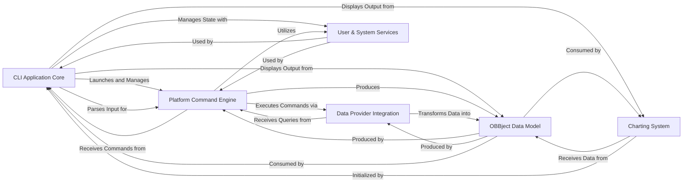

## Component Details

The analysis of the Control Flow Graph (CFG) and the subsequent source code examination reveal a well-structured architecture for OpenBB, designed for modularity, extensibility, and efficient data processing. The initial 20 components from the CFG analysis were effectively consolidated into 6 high-level abstract components during the source analysis, which represent the critical interaction pathways and central modules of the system. These 6 components are fundamental to OpenBB's operation and provide a clear overview of its data flow.

### CLI Application Core
The primary interface for user interaction, responsible for initializing the CLI, parsing user commands, managing the interactive session, and orchestrating the execution of routines and commands. It acts as the central orchestrator for the CLI experience.

**Related Classes/Methods**:

- <a href="https://github.com/OpenBB-finance/OpenBB/blob/master/cli/openbb_cli/cli.py#L7-L20" target="_blank" rel="noopener noreferrer">`cli.openbb_cli.cli.main` (7:20)</a>
- <a href="https://github.com/OpenBB-finance/OpenBB/blob/master/cli/openbb_cli/controllers/cli_controller.py#L64-L499" target="_blank" rel="noopener noreferrer">`cli.openbb_cli.controllers.cli_controller.CLIController` (64:499)</a>
- <a href="https://github.com/OpenBB-finance/OpenBB/blob/master/cli/openbb_cli/session.py#L35-L107" target="_blank" rel="noopener noreferrer">`cli.openbb_cli.session.Session` (35:107)</a>
- <a href="https://github.com/OpenBB-finance/OpenBB/blob/master/cli/openbb_cli/argparse_translator/argparse_translator.py#L42-L489" target="_blank" rel="noopener noreferrer">`cli.openbb_cli.argparse_translator.argparse_translator.ArgparseTranslator` (42:489)</a>

### Platform Command Engine
The core execution engine of the OpenBB Platform. It's responsible for discovering, registering, and executing all available commands. It maps user-requested commands to their underlying functions, handles parameter validation, and dispatches calls to the appropriate data fetching or processing logic. It also manages the dynamic loading of extensions and the static generation of the platform's command structure.

**Related Classes/Methods**:

- <a href="https://github.com/OpenBB-finance/OpenBB/blob/master/openbb_platform/core/openbb_core/app/command_runner.py#L431-L511" target="_blank" rel="noopener noreferrer">`openbb_platform.core.openbb_core.app.command_runner.CommandRunner` (431:511)</a>
- <a href="https://github.com/OpenBB-finance/OpenBB/blob/master/openbb_platform/core/openbb_core/app/router.py#L359-L494" target="_blank" rel="noopener noreferrer">`openbb_platform.core.openbb_core.app.router.CommandMap` (359:494)</a>
- <a href="https://github.com/OpenBB-finance/OpenBB/blob/master/openbb_platform/core/openbb_core/app/extension_loader.py#L32-L176" target="_blank" rel="noopener noreferrer">`openbb_platform.core.openbb_core.app.extension_loader.ExtensionLoader` (32:176)</a>
- <a href="https://github.com/OpenBB-finance/OpenBB/blob/master/openbb_platform/core/openbb_core/app/static/package_builder.py#L82-L280" target="_blank" rel="noopener noreferrer">`openbb_platform.core.openbb_core.app.static.package_builder.PackageBuilder` (82:280)</a>

### Data Provider Integration
Manages all interactions with external data providers. It defines a standardized interface for data access, selects the appropriate provider based on the query, executes the data fetching logic, and transforms raw data into a consistent format for the OpenBB Platform.

**Related Classes/Methods**:

- <a href="https://github.com/OpenBB-finance/OpenBB/blob/master/openbb_platform/core/openbb_core/app/provider_interface.py#L71-L660" target="_blank" rel="noopener noreferrer">`openbb_platform.core.openbb_core.app.provider_interface.ProviderInterface` (71:660)</a>
- <a href="https://github.com/OpenBB-finance/OpenBB/blob/master/openbb_platform/core/openbb_core/provider/query_executor.py#L11-L97" target="_blank" rel="noopener noreferrer">`openbb_platform.core.openbb_core.provider.query_executor.QueryExecutor` (11:97)</a>
- <a href="https://github.com/OpenBB-finance/OpenBB/blob/master/openbb_platform/core/openbb_core/provider/registry_map.py#L19-L206" target="_blank" rel="noopener noreferrer">`openbb_platform.core.openbb_core.provider.registry_map.RegistryMap` (19:206)</a>
- <a href="https://github.com/OpenBB-finance/OpenBB/blob/master/openbb_platform/providers/fmp/openbb_fmp/models/equity_historical.py#L69-L186" target="_blank" rel="noopener noreferrer">`openbb_platform.providers.fmp.openbb_fmp.models.equity_historical.FMPEquityHistoricalFetcher` (69:186)</a>

### OBBject Data Model
The universal data container for all command outputs within the OpenBB Platform. It encapsulates results, warnings, charts, and metadata, providing a consistent structure. It also offers methods to convert the contained data into various formats (e.g., Pandas DataFrame, Polars DataFrame, dictionary, LLM-compatible output).

**Related Classes/Methods**:

- <a href="https://github.com/OpenBB-finance/OpenBB/blob/master/openbb_platform/core/openbb_core/app/model/obbject.py#L41-L386" target="_blank" rel="noopener noreferrer">`openbb_platform.core.openbb_core.app.model.obbject.OBBject` (41:386)</a>

### Charting System
Provides comprehensive data visualization capabilities. It allows for the creation, customization, and rendering of various chart types, integrating with underlying charting libraries and handling display in different environments (e.g., CLI, Jupyter).

**Related Classes/Methods**:

- <a href="https://github.com/OpenBB-finance/OpenBB/blob/master/openbb_platform/obbject_extensions/charting/openbb_charting/charting.py#L39-L683" target="_blank" rel="noopener noreferrer">`openbb_platform.obbject_extensions.charting.openbb_charting.charting.Charting` (39:683)</a>
- <a href="https://github.com/OpenBB-finance/OpenBB/blob/master/openbb_platform/obbject_extensions/charting/openbb_charting/core/backend.py#L23-L392" target="_blank" rel="noopener noreferrer">`openbb_platform.obbject_extensions.charting.openbb_charting.core.backend.Backend` (23:392)</a>
- <a href="https://github.com/OpenBB-finance/OpenBB/blob/master/openbb_platform/obbject_extensions/charting/openbb_charting/core/openbb_figure.py#L46-L1661" target="_blank" rel="noopener noreferrer">`openbb_platform.obbject_extensions.charting.openbb_charting.core.openbb_figure.OpenBBFigure` (46:1661)</a>

### User & System Services
Provides essential cross-cutting functionalities for the OpenBB Platform. This includes managing user authentication and settings synchronization with the OpenBB Hub, as well as a centralized logging mechanism for monitoring application behavior and debugging.

**Related Classes/Methods**:

- <a href="https://github.com/OpenBB-finance/OpenBB/blob/master/openbb_platform/core/openbb_core/app/service/hub_service.py#L17-L287" target="_blank" rel="noopener noreferrer">`openbb_platform.core.openbb_core.app.service.hub_service.HubService` (17:287)</a>
- <a href="https://github.com/OpenBB-finance/OpenBB/blob/master/openbb_platform/core/openbb_core/app/logs/logging_service.py#L26-L258" target="_blank" rel="noopener noreferrer">`openbb_platform.core.openbb_core.app.logs.logging_service.LoggingService` (26:258)</a>

### [FAQ](https://github.com/CodeBoarding/GeneratedOnBoardings/tree/main?tab=readme-ov-file#faq)