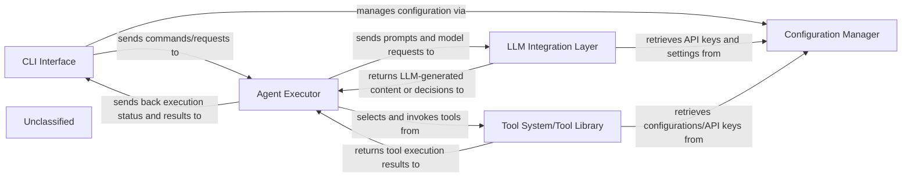

## Details

The system is structured around a central Agent Executor that orchestrates tasks by interacting with an LLM Integration Layer and a Tool System. User interaction is managed through a CLI Interface, which also handles initial configuration via a Configuration Manager. The Agent Executor interprets user prompts, plans actions, and executes them by calling appropriate tools or making LLM requests. The LLM Integration Layer provides a unified interface to various LLMs, while the Tool System offers a library of functionalities to interact with the external environment. The Configuration Manager ensures that all components have access to necessary settings and API keys.

### CLI Interface
The user-facing component responsible for receiving user commands, parsing arguments, and displaying output. It translates user intent into structured requests for the Agent Executor and presents the results back to the user.

**Related Classes/Methods**:

- <a href="https://github.com/nihaaaar22/OpenCopilot-PikoAi/blob/mainSrc/cli.py#L171-L213" target="_blank" rel="noopener noreferrer">`cli`:171-213</a>

### Agent Executor
The central intelligence component that interprets user intent, plans execution strategies, and orchestrates the overall AI workflow. It decides which tools to use, how to interact with LLMs, and manages the iterative execution of tasks. It is responsible for the actual invocation of tools or specific LLM calls as part of a larger workflow, translating high-level plans into actionable operations.

**Related Classes/Methods**:

- <a href="https://github.com/nihaaaar22/OpenCopilot-PikoAi/blob/mainSrc/Agents/Executor/executor.py#L30-L226" target="_blank" rel="noopener noreferrer">`executor`:30-226</a>

### LLM Integration Layer [[Expand]](./LLM_Integration_Layer.md)
Provides a standardized interface for communicating with various Large Language Model providers (e.g., OpenAI, Groq, Mistral AI). It handles API requests, response parsing, and potential model-specific configurations, abstracting the complexities of different LLM APIs.

**Related Classes/Methods**:

- <a href="https://github.com/nihaaaar22/OpenCopilot-PikoAi/blob/mainSrc/llm_interface/llm.py#L29-L74" target="_blank" rel="noopener noreferrer">`LiteLLMInterface`:29-74</a>

### Tool System/Tool Library
A modular collection of functionalities (tools) that the Agent Executor can leverage to interact with the external environment, perform data processing, or access specific information (e.g., web search, file I/O, document parsing).

**Related Classes/Methods**:

- <a href="https://github.com/nihaaaar22/OpenCopilot-PikoAi/blob/mainSrc/Tools/web_search.py#L8-L58" target="_blank" rel="noopener noreferrer">`web_search`:8-58</a>

### Configuration Manager
Responsible for loading, storing, and providing access to application-wide settings, environment variables, and sensitive credentials (e.g., API keys). It ensures that other components can retrieve necessary configurations securely and efficiently.

**Related Classes/Methods**:

- <a href="https://github.com/nihaaaar22/OpenCopilot-PikoAi/blob/mainSrc/cli.py#L70-L89" target="_blank" rel="noopener noreferrer">`load_config`:70-89</a>
- <a href="https://github.com/nihaaaar22/OpenCopilot-PikoAi/blob/mainSrc/cli.py#L91-L94" target="_blank" rel="noopener noreferrer">`save_config`:91-94</a>

### Unclassified
Component for all unclassified files and utility functions (Utility functions/External Libraries/Dependencies)

**Related Classes/Methods**: _None_

### [FAQ](https://github.com/CodeBoarding/GeneratedOnBoardings/tree/main?tab=readme-ov-file#faq)