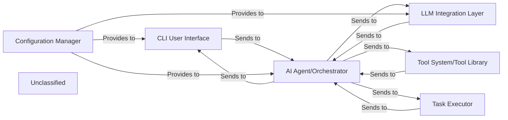

## Details

The system is structured around a central AI Agent/Orchestrator that interprets user commands and coordinates tasks. User interaction occurs through a CLI User Interface, which also handles initial prompt processing and file attachments. The AI Agent leverages an LLM Integration Layer to communicate with various Large Language Models and a Tool System/Tool Library to execute specific actions. A dedicated Task Executor handles system-level commands and scripts. All components rely on a Configuration Manager for consistent settings and API key management.

### CLI User Interface [[Expand]](./CLI_User_Interface.md)
The primary interface for user interaction, command parsing, initial prompt processing (including file attachments), and overall application flow. It handles user input, displays output, and orchestrates the initial interaction with the AI Agent.

**Related Classes/Methods**:

- <a href="https://github.com/nihaaaar22/OpenCopilot-PikoAi/blob/mainSrc/OpenCopilot.py#L205-L270" target="_blank" rel="noopener noreferrer">`Src.OpenCopilot.OpenCopilot.run`:205-270</a>
- <a href="https://github.com/nihaaaar22/OpenCopilot-PikoAi/blob/mainSrc/OpenCopilot.py#L115-L170" target="_blank" rel="noopener noreferrer">`Src.OpenCopilot.OpenCopilot.extract_files_and_process_prompt`:115-170</a>
- <a href="https://github.com/nihaaaar22/OpenCopilot-PikoAi/blob/mainSrc/cli.py#L171-L213" target="_blank" rel="noopener noreferrer">`Src.cli.cli`:171-213</a>

### AI Agent/Orchestrator [[Expand]](./AI_Agent_Orchestrator.md)
The intelligent core responsible for interpreting user commands, orchestrating complex tasks, selecting appropriate tools, and managing interactions with various LLM providers. It acts as the central decision-making unit.

**Related Classes/Methods**:

- <a href="https://github.com/nihaaaar22/OpenCopilot-PikoAi/blob/mainSrc/Agents/Executor/executor.py#L124-L179" target="_blank" rel="noopener noreferrer">`Src.Agents.Executor.executor.executor.run_task`:124-179</a>

### LLM Integration Layer [[Expand]](./LLM_Integration_Layer.md)
Provides a standardized interface for interacting with various Large Language Models (LLMs) from different providers (e.g., OpenAI, Groq, Mistral AI, LiteLLM). It abstracts away the specifics of each LLM API.

**Related Classes/Methods**:

- <a href="https://github.com/nihaaaar22/OpenCopilot-PikoAi/blob/mainSrc/llm_interface/llm.py#L51-L68" target="_blank" rel="noopener noreferrer">`Src.llm_interface.llm.LiteLLMInterface.chat`:51-68</a>

### Tool System/Tool Library
A collection of modular tools and utilities that the AI Agent can dynamically select and execute to perform specific actions (e.g., web search, file operations, code execution, document parsing). It provides an extensible framework for adding new capabilities.

**Related Classes/Methods**:

- <a href="https://github.com/nihaaaar22/OpenCopilot-PikoAi/blob/mainSrc/Tools/tool_manager.py#L98-L110" target="_blank" rel="noopener noreferrer">`Src.Tools.tool_manager.call_tool`:98-110</a>

### Configuration Manager
Handles the loading, saving, and management of application settings, user preferences, API keys, and other configurable parameters. It ensures consistent behavior across sessions.

**Related Classes/Methods**:

- <a href="https://github.com/nihaaaar22/OpenCopilot-PikoAi/blob/mainSrc/cli.py#L70-L89" target="_blank" rel="noopener noreferrer">`Src.cli.load_config`:70-89</a>
- <a href="https://github.com/nihaaaar22/OpenCopilot-PikoAi/blob/mainSrc/cli.py#L91-L94" target="_blank" rel="noopener noreferrer">`Src.cli.save_config`:91-94</a>

### Task Executor
Responsible for executing system-level commands, scripts, or long-running processes as directed by the AI Agent. It handles the actual execution of tasks that might involve interacting with the operating system or external services.

**Related Classes/Methods**:

- <a href="https://github.com/nihaaaar22/OpenCopilot-PikoAi/blob/mainSrc/Agents/Executor/executor.py#L124-L179" target="_blank" rel="noopener noreferrer">`Src.Agents.Executor.executor.executor.run_task`:124-179</a>

### Unclassified
Component for all unclassified files and utility functions (Utility functions/External Libraries/Dependencies)

**Related Classes/Methods**: _None_

### [FAQ](https://github.com/CodeBoarding/GeneratedOnBoardings/tree/main?tab=readme-ov-file#faq)