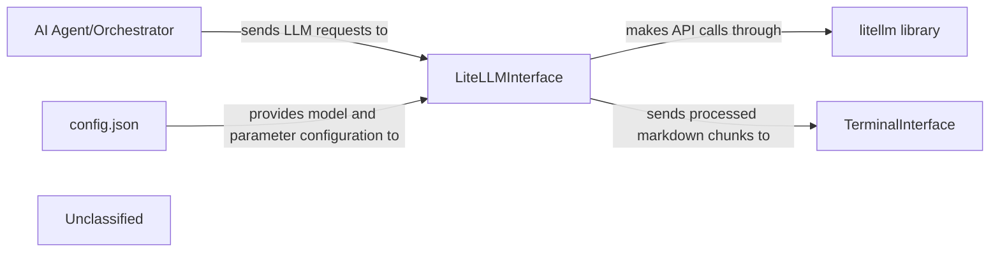

## Details

The system's core functionality revolves around an `AI Agent/Orchestrator` that manages tasks and interacts with Large Language Models (LLMs) through a dedicated `LiteLLMInterface`. This interface acts as an abstraction layer, utilizing the `litellm library` to communicate with various LLM providers, ensuring flexibility and ease of integration. Configuration for the LLM interactions, such as model names and parameters, is dynamically loaded from `config.json`. As the `LiteLLMInterface` receives streaming responses from the LLMs, it forwards these to the `TerminalInterface`, which is responsible for processing and displaying the markdown-formatted output incrementally to the user in the command-line interface. This architecture ensures a clear separation of concerns, allowing the orchestrator to focus on task management while the LLM integration and user output are handled by specialized components.

### LiteLLMInterface
The core component of the LLM Integration Layer. It provides a standardized and unified interface for interacting with various Large Language Models (LLMs) by leveraging the `litellm` library, thereby abstracting away provider-specific details. It manages the selection of the LLM model, loads the preferred model name and `temperature` from `config.json`, and handles streaming responses from LLMs, processing and displaying output incrementally.

**Related Classes/Methods**:

- <a href="https://github.com/nihaaaar22/OpenCopilot-PikoAi/blob/mainSrc/llm_interface/llm.py#L29-L74" target="_blank" rel="noopener noreferrer">`llm_interface.llm.LiteLLMInterface`:29-74</a>

### AI Agent/Orchestrator [[Expand]](./AI_Agent_Orchestrator.md)
The primary upstream component that orchestrates tasks and initiates calls to the `LLM Integration Layer` (specifically `LiteLLMInterface`) when LLM capabilities are required for task execution or decision-making. It acts as the entry point for LLM interactions within the broader AI agent system.

**Related Classes/Methods**:

- <a href="https://github.com/nihaaaar22/OpenCopilot-PikoAi/blob/mainSrc/Agents/Executor/executor.py#L30-L226" target="_blank" rel="noopener noreferrer">`Agents.Executor.executor.executor`:30-226</a>

### TerminalInterface
A utility component responsible for real-time processing and displaying formatted markdown chunks of LLM responses in the command-line interface. It ensures that streaming LLM output is presented clearly and incrementally to the user.

**Related Classes/Methods**:

- <a href="https://github.com/nihaaaar22/OpenCopilot-PikoAi/blob/mainSrc/Utils/ter_interface.py#L13-L157" target="_blank" rel="noopener noreferrer">`Utils.ter_interface.TerminalInterface`:13-157</a>

### config.json
A configuration file used to store dynamic settings for the `LLM Integration Layer`, such as the preferred LLM model name, API keys (if not from environment variables), and other parameters like `temperature` for LLM calls.

**Related Classes/Methods**:

- `config.json`

### litellm library
An external Python library that serves as a robust abstraction layer, unifying the API calls to various Large Language Models (LLMs) from different providers (e.g., OpenAI, Groq, Mistral AI). `LiteLLMInterface` leverages this library to achieve provider agnosticism.

**Related Classes/Methods**:

- <a href="https://github.com/nihaaaar22/OpenCopilot-PikoAi/blob/mainSrc/llm_interface/llm.py#L29-L74" target="_blank" rel="noopener noreferrer">`litellm`:29-74</a>

### Unclassified
Component for all unclassified files and utility functions (Utility functions/External Libraries/Dependencies)

**Related Classes/Methods**: _None_

### [FAQ](https://github.com/CodeBoarding/GeneratedOnBoardings/tree/main?tab=readme-ov-file#faq)