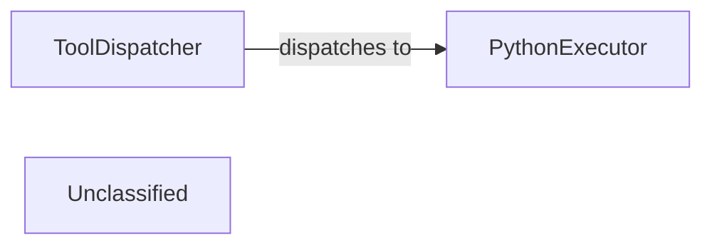

## Details

The tooling subsystem is centered around the ToolDispatcher, which provides a unified interface for the AI Agent to interact with various tools. The ToolDispatcher uses a tools_function_map to route requests to specific tool implementations. One such critical tool is the PythonExecutor, which enables the secure execution of dynamic Python code. This architecture allows for flexible and extensible tool management, where new tools can be integrated by simply updating the tools_function_map and the ToolDispatcher handles the execution flow, including specialized executors like PythonExecutor for complex tasks.

### ToolDispatcher
Acts as the central orchestrator for all tools within the system. It is responsible for registering, discovering, and executing the diverse set of tools available to the AI Agent. This component serves as the primary interface between the AI Agent/Orchestrator and the individual tool implementations, ensuring modularity and extensibility. The `call_tool` function is the main entry point for dispatching tool requests.

**Related Classes/Methods**:

- <a href="https://github.com/nihaaaar22/OpenCopilot-PikoAi/blob/mainSrc/Tools/tool_manager.py#L98-L110" target="_blank" rel="noopener noreferrer">`call_tool`:98-110</a>

### PythonExecutor
A specialized and secure tool designed to execute arbitrary Python code in a controlled environment. This capability is vital for the AI Agent, allowing it to perform dynamic scripting, extend its functionalities on the fly, and handle complex tasks that require custom logic beyond predefined tools.

**Related Classes/Methods**:

- <a href="https://github.com/nihaaaar22/OpenCopilot-PikoAi/blob/mainSrc/Env/python_executor.py#L10-L113" target="_blank" rel="noopener noreferrer">`PythonExecutor`:10-113</a>

### Unclassified
Component for all unclassified files and utility functions (Utility functions/External Libraries/Dependencies)

**Related Classes/Methods**: _None_

### [FAQ](https://github.com/CodeBoarding/GeneratedOnBoardings/tree/main?tab=readme-ov-file#faq)