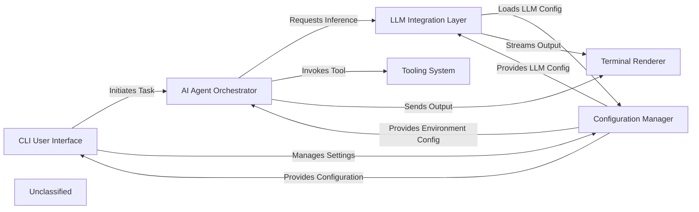

## Details

The PikoAi application is structured around a core CLI User Interface that serves as the primary entry point for user interaction. This interface is responsible for parsing user commands, processing prompts (including file inclusions), and initiating tasks. It interacts with the Configuration Manager to load and save application settings and user preferences. At the heart of the AI-driven workflow is the AI Agent Orchestrator. This component receives tasks from the CLI User Interface and intelligently manages the AI's decision-making and task execution. It relies on the LLM Integration Layer to interact with various Large Language Models for inference and response generation. The AI Agent Orchestrator also leverages the Tooling System to dynamically invoke external and internal tools, including a secure Python code executor, to accomplish complex tasks. All outputs and progress from the AI Agent Orchestrator are directed to the Terminal Renderer for formatted display to the user. The LLM Integration Layer provides a standardized abstraction for communicating with different LLM providers, handling streaming responses and model-specific configurations. It retrieves necessary LLM configurations from the Configuration Manager. The Tooling System is responsible for managing and executing a diverse set of tools, enabling the AI to interact with the environment, perform file operations, web searches, and execute dynamic code. The PythonExecutor is an integral part of this system, providing a secure sandbox for Python script execution. The Configuration Manager centralizes the handling of all application settings, including API keys and LLM model selections, ensuring consistent configuration across all components. Finally, the Terminal Renderer is dedicated to presenting rich, interactive output to the user, formatting AI responses, tool execution logs, and other information in a clear and readable manner. It receives output streams from both the AI Agent Orchestrator and the LLM Integration Layer. This architecture promotes modularity, allowing for independent development and easier maintenance of each component, while ensuring a clear and efficient data flow for AI-powered task automation.

### CLI User Interface [[Expand]](./CLI_User_Interface.md)
The primary interface for user interaction, command parsing, initial prompt processing, and overall application flow. It's the direct interface for the user.

**Related Classes/Methods**:

- <a href="https://github.com/nihaaaar22/OpenCopilot-PikoAi/blob/mainSrc/OpenCopilot.py#L205-L270" target="_blank" rel="noopener noreferrer">`OpenCopilot.run`:205-270</a>
- <a href="https://github.com/nihaaaar22/OpenCopilot-PikoAi/blob/mainSrc/cli.py#L171-L213" target="_blank" rel="noopener noreferrer">`cli`:171-213</a>
- <a href="https://github.com/nihaaaar22/OpenCopilot-PikoAi/blob/mainSrc/OpenCopilot.py#L115-L170" target="_blank" rel="noopener noreferrer">`OpenCopilot.extract_files_and_process_prompt`:115-170</a>

### AI Agent Orchestrator [[Expand]](./AI_Agent_Orchestrator.md)
The central intelligence component responsible for managing AI workflows, executing tasks, and making decisions based on LLM inference and tool usage.

**Related Classes/Methods**:

- <a href="https://github.com/nihaaaar22/OpenCopilot-PikoAi/blob/mainSrc/Agents/Executor/executor.py#L124-L178" target="_blank" rel="noopener noreferrer">`executor.run_task`:124-178</a>

### LLM Integration Layer [[Expand]](./LLM_Integration_Layer.md)
Provides a standardized interface for interacting with various Large Language Models (LLMs), abstracting away provider specifics and handling streaming responses.

**Related Classes/Methods**:

- <a href="https://github.com/nihaaaar22/OpenCopilot-PikoAi/blob/mainSrc/llm_interface/llm.py" target="_blank" rel="noopener noreferrer">`LiteLLMInterface.chat`</a>

### Tooling System [[Expand]](./Tooling_System.md)
Manages the registration, discovery, and dynamic execution of various external and internal tools, including a secure Python code executor for dynamic script execution.

**Related Classes/Methods**:

- <a href="https://github.com/nihaaaar22/OpenCopilot-PikoAi/blob/mainSrc/Tools/tool_manager.py#L98-L110" target="_blank" rel="noopener noreferrer">`tool_manager.call_tool`:98-110</a>
- <a href="https://github.com/nihaaaar22/OpenCopilot-PikoAi/blob/mainSrc/Env/python_executor.py" target="_blank" rel="noopener noreferrer">`PythonExecutor.execute`</a>

### Configuration Manager
Handles the loading, saving, and management of application configurations, environment variables (like API keys), and user preferences across different components.

**Related Classes/Methods**:

- <a href="https://github.com/nihaaaar22/OpenCopilot-PikoAi/blob/mainSrc/cli.py#L70-L89" target="_blank" rel="noopener noreferrer">`load_config`:70-89</a>
- <a href="https://github.com/nihaaaar22/OpenCopilot-PikoAi/blob/mainSrc/cli.py#L91-L94" target="_blank" rel="noopener noreferrer">`save_config`:91-94</a>
- <a href="https://github.com/nihaaaar22/OpenCopilot-PikoAi/blob/mainSrc/cli.py#L98-L143" target="_blank" rel="noopener noreferrer">`ensure_api_key`:98-143</a>

### Terminal Renderer
Responsible for formatting and displaying rich, interactive output to the command-line terminal, including AI responses, tool execution details, and markdown rendering.

**Related Classes/Methods**:

- <a href="https://github.com/nihaaaar22/OpenCopilot-PikoAi/blob/mainSrc/Utils/ter_interface.py" target="_blank" rel="noopener noreferrer">`TerminalInterface.process_markdown_chunk`</a>
- <a href="https://github.com/nihaaaar22/OpenCopilot-PikoAi/blob/mainSrc/Utils/ter_interface.py" target="_blank" rel="noopener noreferrer">`TerminalInterface.tool_output_log`</a>

### Unclassified
Component for all unclassified files and utility functions (Utility functions/External Libraries/Dependencies)

**Related Classes/Methods**: _None_

### [FAQ](https://github.com/CodeBoarding/GeneratedOnBoardings/tree/main?tab=readme-ov-file#faq)