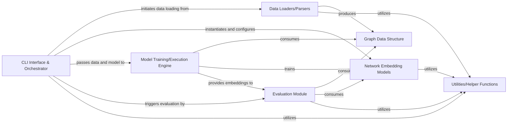

## Details

The OpenNE project is structured around a command-line interface that orchestrates the entire network embedding pipeline. It begins by loading and representing graph data using a dedicated graph data structure. This prepared data is then fed into various network embedding models for training. The trained models generate embeddings, which are subsequently evaluated for quality and performance. Utility functions support various operations across these stages.

### CLI Interface & Orchestrator [[Expand]](./CLI_Interface_Orchestrator.md)
Interprets command-line arguments, configures parameters, manages the sequential flow of the entire pipeline (data loading, model execution, evaluation), and handles high-level errors. It acts as the central control unit.

**Related Classes/Methods**:

- <a href="https://github.com/thunlp/OpenNE/blob/master/src/openne/__main__.py" target="_blank" rel="noopener noreferrer">`openne.__main__`</a>

### Data Loaders/Parsers
Responsible for loading graph data from various file formats (e.g., adjacency lists, edge lists) into the internal graph data structure. It handles the initial parsing and preparation of raw graph data.

**Related Classes/Methods**:

- <a href="https://github.com/thunlp/OpenNE/blob/master/src/openne/graph.py#L13-L118" target="_blank" rel="noopener noreferrer">`openne.graph.Graph`:13-118</a>

### Graph Data Structure
Provides a standardized in-memory representation of the loaded graph data, facilitating efficient access and manipulation by other components. This component encapsulates the graph's nodes, edges, and their properties.

**Related Classes/Methods**:

- <a href="https://github.com/thunlp/OpenNE/blob/master/src/openne/graph.py#L13-L118" target="_blank" rel="noopener noreferrer">`openne.graph.Graph`:13-118</a>

### Network Embedding Models
Implements various network embedding algorithms (e.g., DeepWalk, Node2Vec, LINE, SDNE, GCN). Each model takes a graph as input and produces low-dimensional vector representations (embeddings) for its nodes.

**Related Classes/Methods**:

- <a href="https://github.com/thunlp/OpenNE/blob/master/src/openne/node2vec.py" target="_blank" rel="noopener noreferrer">`openne.node2vec`</a>

### Model Training/Execution Engine
Manages the execution of the selected network embedding model, including the training process. It handles the iteration over data, optimization steps, and the generation of node embeddings. The main orchestrator (`__main__`) initiates and oversees this process.

**Related Classes/Methods**:

- <a href="https://github.com/thunlp/OpenNE/blob/master/src/openne/__main__.py" target="_blank" rel="noopener noreferrer">`openne.__main__`</a>
- <a href="https://github.com/thunlp/OpenNE/blob/master/src/openne/gcn/train.py" target="_blank" rel="noopener noreferrer">`openne.gcn.train`</a>

### Evaluation Module [[Expand]](./Evaluation_Module.md)
Assesses the quality and performance of the generated graph embeddings. This typically involves tasks like node classification or link prediction, using metrics to quantify the effectiveness of the embeddings.

**Related Classes/Methods**:

- <a href="https://github.com/thunlp/OpenNE/blob/master/src/openne/classify.py" target="_blank" rel="noopener noreferrer">`openne.classify`</a>

### Utilities/Helper Functions
Provides general-purpose functions that support various operations across the system, such as argument parsing helpers, data preprocessing, or common mathematical operations.

**Related Classes/Methods**:

- <a href="https://github.com/thunlp/OpenNE/blob/master/src/openne/gcn/utils.py" target="_blank" rel="noopener noreferrer">`openne.gcn.utils`</a>

### [FAQ](https://github.com/CodeBoarding/GeneratedOnBoardings/tree/main?tab=readme-ov-file#faq)