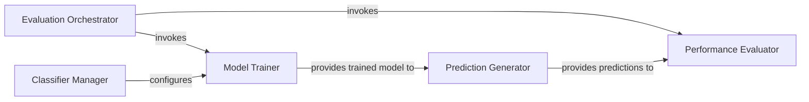

## Details

The `openne.classify` subsystem provides a comprehensive framework for evaluating graph embeddings through a classification pipeline. It orchestrates the entire process from data preparation and model training to prediction and performance evaluation. The central `Classifier` component manages the workflow, leveraging a `TopKRanker` for specialized multi-label classification. This design follows a "Pipeline" architectural pattern, ensuring a clear, sequential flow of operations for robust embedding evaluation.

### Evaluation Orchestrator
This component, primarily embodied by the `Classifier.split_train_evaluate` method, serves as the primary entry point and orchestrator for the entire embedding evaluation pipeline. It manages the end-to-end workflow, including splitting the dataset into training and testing sets, initiating the training of a downstream classifier, and subsequently triggering the performance evaluation. This aligns with the "Pipeline" architectural pattern.

**Related Classes/Methods**:

- <a href="https://github.com/thunlp/OpenNE/blob/master/src/openne/classify.py" target="_blank" rel="noopener noreferrer">`openne.classify.Classifier.split_train_evaluate`</a>

### Classifier Manager
This component, represented by the `Classifier` class's initialization (`__init__`), is responsible for managing the configuration and lifecycle of the downstream classification model. It initializes the classifier (specifically, the `TopKRanker` with a provided base classifier) and sets up the `MultiLabelBinarizer` for data preparation.

**Related Classes/Methods**:

- <a href="https://github.com/thunlp/OpenNE/blob/master/src/openne/classify.py" target="_blank" rel="noopener noreferrer">`openne.classify.Classifier.__init__`</a>

### Model Trainer
This component, implemented by the `Classifier.train` method, focuses on training a machine learning model (e.g., a Logistic Regression classifier) using the learned graph embeddings as input features. It handles the binarization of labels and fits the `TopKRanker` model to the training data. Its output is a trained model ready for making predictions.

**Related Classes/Methods**:

- <a href="https://github.com/thunlp/OpenNE/blob/master/src/openne/classify.py" target="_blank" rel="noopener noreferrer">`openne.classify.Classifier.train`</a>

### Prediction Generator
This component, found in the `Classifier.predict` method, takes the trained classification model and new graph embeddings as input to generate predictions. It applies the learned model to infer labels or ranks for unseen data points, utilizing the `TopKRanker`'s prediction capabilities.

**Related Classes/Methods**:

- <a href="https://github.com/thunlp/OpenNE/blob/master/src/openne/classify.py" target="_blank" rel="noopener noreferrer">`openne.classify.Classifier.predict`</a>

### Performance Evaluator
This component, implemented by the `Classifier.evaluate` method, is dedicated to assessing the quality and effectiveness of the predictions generated by the Prediction Generator. It compares these predictions against ground truth labels and computes various relevant performance metrics (e.g., accuracy, F1-score) to quantify the embedding quality.

**Related Classes/Methods**:

- <a href="https://github.com/thunlp/OpenNE/blob/master/src/openne/classify.py" target="_blank" rel="noopener noreferrer">`openne.classify.Classifier.evaluate`</a>

### [FAQ](https://github.com/CodeBoarding/GeneratedOnBoardings/tree/main?tab=readme-ov-file#faq)