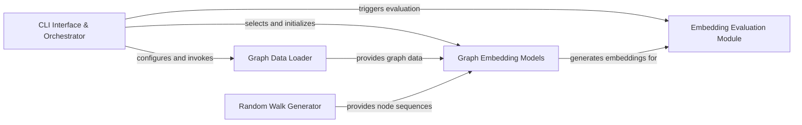

## Details

The `OpenNE` architecture is designed as a flexible, data-driven pipeline for graph embedding. The **CLI Interface & Orchestrator** serves as the central control point, guiding the execution flow. It initiates data processing via the **Graph Data Loader**, which prepares graph data for various embedding algorithms. Depending on the chosen algorithm, the **Random Walk Generator** may provide essential node sequences. The core functionality resides within the **Graph Embedding Models** component, an interchangeable collection of algorithms that transform graph data into low-dimensional embeddings. Finally, the **Embedding Evaluation Module** consumes these embeddings to assess their quality through downstream tasks. This modular design facilitates easy integration of new algorithms and clear separation of concerns, making it ideal for visual representation as a sequential data flow diagram.

### CLI Interface & Orchestrator [[Expand]](./CLI_Interface_Orchestrator.md)
The primary entry point, responsible for parsing command-line arguments, configuring the execution flow, and orchestrating the entire pipeline from data loading to model execution and evaluation.

**Related Classes/Methods**:

- <a href="https://github.com/thunlp/OpenNE/blob/master/src/openne/__main__.py" target="_blank" rel="noopener noreferrer">`src/openne/__main__.py`</a>

### Graph Data Loader
Handles the ingestion of raw graph data from various formats, transforming it into an internal graph representation suitable for processing by embedding algorithms. It also manages node encoding and feature loading.

**Related Classes/Methods**:

- <a href="https://github.com/thunlp/OpenNE/blob/master/src/openne/graph.py" target="_blank" rel="noopener noreferrer">`src/openne/graph.py`</a>

### Random Walk Generator
A utility component dedicated to generating random walks on graphs. These sequences are crucial inputs for specific graph embedding algorithms that rely on node sequences to learn representations.

**Related Classes/Methods**:

- <a href="https://github.com/thunlp/OpenNE/blob/master/src/openne/walker.py" target="_blank" rel="noopener noreferrer">`src/openne/walker.py`</a>

### Graph Embedding Models
This is the central, interchangeable component group encompassing all implemented graph embedding algorithms. Each sub-component within this group takes graph data (and potentially random walks) as input and produces low-dimensional node or graph embeddings.

**Related Classes/Methods**:

- <a href="https://github.com/thunlp/OpenNE/blob/master/src/openne/gf.py" target="_blank" rel="noopener noreferrer">`src/openne/gf.py`</a>
- <a href="https://github.com/thunlp/OpenNE/blob/master/src/openne/grarep.py" target="_blank" rel="noopener noreferrer">`src/openne/grarep.py`</a>
- <a href="https://github.com/thunlp/OpenNE/blob/master/src/openne/hope.py" target="_blank" rel="noopener noreferrer">`src/openne/hope.py`</a>
- <a href="https://github.com/thunlp/OpenNE/blob/master/src/openne/lap.py" target="_blank" rel="noopener noreferrer">`src/openne/lap.py`</a>
- <a href="https://github.com/thunlp/OpenNE/blob/master/src/openne/lle.py" target="_blank" rel="noopener noreferrer">`src/openne/lle.py`</a>
- <a href="https://github.com/thunlp/OpenNE/blob/master/src/openne/tadw.py" target="_blank" rel="noopener noreferrer">`src/openne/tadw.py`</a>
- <a href="https://github.com/thunlp/OpenNE/blob/master/src/openne/line.py" target="_blank" rel="noopener noreferrer">`src/openne/line.py`</a>
- <a href="https://github.com/thunlp/OpenNE/blob/master/src/openne/sdne.py" target="_blank" rel="noopener noreferrer">`src/openne/sdne.py`</a>
- <a href="https://github.com/thunlp/OpenNE/blob/master/src/openne/node2vec.py" target="_blank" rel="noopener noreferrer">`src/openne/node2vec.py`</a>
- <a href="https://github.com/thunlp/OpenNE/blob/master/src/openne/gcn/gcnAPI.py" target="_blank" rel="noopener noreferrer">`src/openne/gcn/gcnAPI.py`</a>
- <a href="https://github.com/thunlp/OpenNE/blob/master/src/openne/gcn/models.py" target="_blank" rel="noopener noreferrer">`src/openne/gcn/models.py`</a>
- <a href="https://github.com/thunlp/OpenNE/blob/master/src/openne/gcn/layers.py" target="_blank" rel="noopener noreferrer">`src/openne/gcn/layers.py`</a>
- <a href="https://github.com/thunlp/OpenNE/blob/master/src/openne/gcn/utils.py" target="_blank" rel="noopener noreferrer">`src/openne/gcn/utils.py`</a>
- <a href="https://github.com/thunlp/OpenNE/blob/master/src/openne/gcn/inits.py" target="_blank" rel="noopener noreferrer">`src/openne/gcn/inits.py`</a>
- <a href="https://github.com/thunlp/OpenNE/blob/master/src/openne/gcn/metrics.py" target="_blank" rel="noopener noreferrer">`src/openne/gcn/metrics.py`</a>
- <a href="https://github.com/thunlp/OpenNE/blob/master/src/openne/gcn/train.py" target="_blank" rel="noopener noreferrer">`src/openne/gcn/train.py`</a>

### Embedding Evaluation Module [[Expand]](./Embedding_Evaluation_Module.md)
Responsible for assessing the quality and performance of the learned graph embeddings. It typically performs downstream tasks, such as node classification, using the embeddings and reports relevant metrics.

**Related Classes/Methods**:

- <a href="https://github.com/thunlp/OpenNE/blob/master/src/openne/classify.py" target="_blank" rel="noopener noreferrer">`src/openne/classify.py`</a>

### [FAQ](https://github.com/CodeBoarding/GeneratedOnBoardings/tree/main?tab=readme-ov-file#faq)