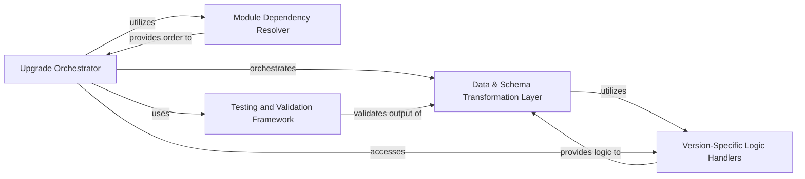

## Details

One paragraph explaining the functionality which is represented by this graph. What the main flow is and what is its purpose.

### Upgrade Orchestrator
The central control unit that manages the entire Odoo database upgrade process. It sequences module upgrades, coordinates data and schema transformations, and oversees the overall execution flow.

**Related Classes/Methods**:

- `odoo.modules.migration`

### Data & Schema Transformation Layer [[Expand]](./Data_Schema_Transformation_Layer.md)
This combined component handles all version-specific changes to the Odoo database, encompassing both data transformations (e.g., data model changes, cleaning, enrichment) and schema modifications (e.g., model/field renames, additions, removals). It encapsulates the core logic for adapting the database to the target Odoo version.

**Related Classes/Methods**:

- `odoo.models`
- `odoo.api`

### Version-Specific Logic Handlers
Contains the specific migration scripts and logic tailored for different Odoo versions. These handlers provide the precise instructions for data and schema adaptations required for each unique upgrade path.

**Related Classes/Methods**:

### Module Dependency Resolver
Identifies and resolves the correct upgrade order for Odoo modules based on their interdependencies, ensuring that prerequisite modules are upgraded before their dependents.

**Related Classes/Methods**:

- `odoo.modules.graph`

### Testing and Validation Framework
Provides a suite of tools and mechanisms to verify the integrity, consistency, and correctness of the Odoo database after transformations, ensuring the upgrade was successful and data is valid.

**Related Classes/Methods**:

- <a href="https://github.com/OCA/OpenUpgrade/blob/17.0/openupgrade_scripts/scripts/account/tests/test_account_migration.py" target="_blank" rel="noopener noreferrer">`openupgrade_scripts.scripts.account.tests.test_account_migration`</a>

### [FAQ](https://github.com/CodeBoarding/GeneratedOnBoardings/tree/main?tab=readme-ov-file#faq)