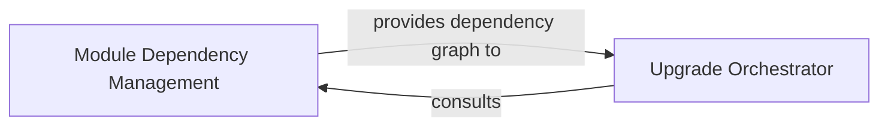

## Details

One paragraph explaining the functionality which is represented by this graph. What the main flow is and what is its purpose.

### Module Dependency Management [[Expand]](./Module_Dependency_Management.md)
Responsible for analyzing and resolving the intricate dependencies between various Odoo modules. It ensures that modules are upgraded in the correct topological order, which is vital for maintaining data integrity, functional consistency, and preventing issues arising from unfulfilled dependencies during the migration process. This component heavily relies on the Odoo Core Patching Framework to modify Odoo's native module graph computation for accurate dependency resolution during the upgrade process.

**Related Classes/Methods**:

- `openupgrade_framework.odoo_patch.odoo.modules.graph`
- `openupgrade_framework.odoo_patch.odoo.modules.migration`

### Upgrade Orchestrator
The central control component that manages and coordinates the entire Odoo module upgrade process. It initiates the upgrade sequence for each module, relying on the Module Dependency Management component to determine the correct order of execution.

**Related Classes/Methods**: _None_

### [FAQ](https://github.com/CodeBoarding/GeneratedOnBoardings/tree/main?tab=readme-ov-file#faq)