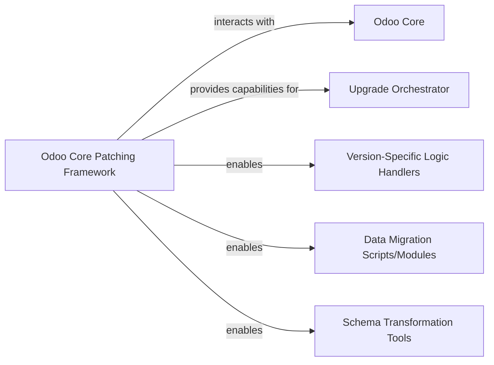

## Details

Abstract Components Overview of OpenUpgrade

### Odoo Core Patching Framework [[Expand]](./Odoo_Core_Patching_Framework.md)
A foundational component that provides mechanisms to dynamically modify or extend Odoo's core functionalities during the upgrade process. This allows OpenUpgrade to override or augment Odoo's default behavior, such as API interactions, model definitions, and module graph computations. It serves as a critical Compatibility and Transformation Layer, essential for seamless migration and compatibility adjustments across different Odoo versions.

**Related Classes/Methods**:

- `openupgrade_framework.odoo_patch` (1:1)
- `openupgrade_framework.odoo_patch.odoo.api`
- `openupgrade_framework.odoo_patch.odoo.models`
- `openupgrade_framework.odoo_patch.odoo.modules.graph`

### Odoo Core
The fundamental, unmodified Odoo application codebase that serves as the target for patching and upgrade operations. It represents the base system whose functionalities and data structures are adapted by OpenUpgrade.

**Related Classes/Methods**: _None_

### Upgrade Orchestrator
The high-level component responsible for managing and coordinating the entire OpenUpgrade process. It leverages the Odoo Core Patching Framework to apply necessary modifications and ensure a smooth transition between Odoo versions.

**Related Classes/Methods**: _None_

### Version-Specific Logic Handlers
Modules or scripts that encapsulate business logic and specific adjustments required for migrating data and functionalities between particular Odoo versions. These handlers are enabled and supported by the Odoo Core Patching Framework to interact with Odoo's modified environment.

**Related Classes/Methods**: _None_

### Data Migration Scripts/Modules
Components dedicated to transforming and migrating data structures and content from an older Odoo database schema to a newer one. They rely on the Odoo Core Patching Framework for adapting Odoo's ORM and API during data manipulation.

**Related Classes/Methods**: _None_

### Schema Transformation Tools
Utilities or components focused on adapting and transforming the database schema itself during an Odoo upgrade. They are enabled by the Odoo Core Patching Framework to interact with Odoo's model definitions and database layer for schema adjustments.

**Related Classes/Methods**: _None_

### [FAQ](https://github.com/CodeBoarding/GeneratedOnBoardings/tree/main?tab=readme-ov-file#faq)