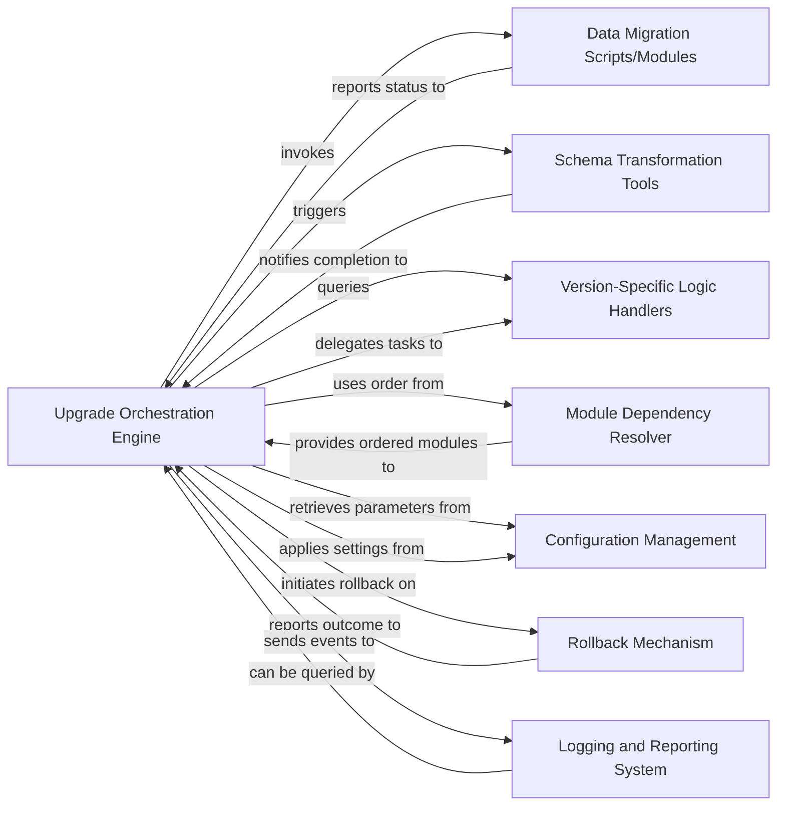

## Details

This analysis synthesizes the core components of the OpenUpgrade subsystem, focusing on the Upgrade Orchestration Engine as the central element and its interactions with other critical parts, adhering to the specified architectural patterns for Odoo module upgrades.

### Upgrade Orchestration Engine [[Expand]](./Upgrade_Orchestration_Engine.md)
The core control unit of OpenUpgrade, responsible for orchestrating the entire database upgrade process. It determines the optimal upgrade path, manages the execution flow of migration steps, and ensures the correct sequencing of operations across different Odoo versions and modules. It acts as the primary entry point for initiating and overseeing database upgrades.

**Related Classes/Methods**:

- `openupgrade_framework/__init__.py`
- <a href="https://github.com/OCA/OpenUpgrade/blob/17.0/openupgrade_framework/odoo_patch/odoo/modules/migration.py#L1-L1" target="_blank" rel="noopener noreferrer">`openupgrade_framework/odoo_patch/odoo/modules/migration.py` (1:1)</a>

### Data Migration Scripts/Modules
Contains version-specific Python scripts and Odoo modules designed to perform data transformations and migrations between different Odoo database schemas and data models. These scripts handle the actual data manipulation during the upgrade process.

**Related Classes/Methods**:

- `openupgrade_framework/migrations/` (1:1)

### Schema Transformation Tools
Provides utilities and logic for applying structural changes to the database schema, such as adding/removing columns, altering table definitions, or managing constraints, often in conjunction with Odoo's ORM.

**Related Classes/Methods**:

- `openupgrade_framework/schema/` (1:1)

### Version-Specific Logic Handlers
Encapsulates logic and configurations unique to specific Odoo versions. This component ensures that upgrade steps are correctly adapted to the target Odoo version's API changes, data structures, and module behaviors.

**Related Classes/Methods**:

- `openupgrade_framework/version_handlers/` (1:1)

### Module Dependency Resolver
Analyzes the dependencies between Odoo modules and determines the correct order in which they must be upgraded to prevent conflicts and ensure data integrity.

**Related Classes/Methods**:

- `openupgrade_framework/dependency_resolver.py` (1:1)

### Configuration Management
Manages and provides access to various configuration parameters for the OpenUpgrade process, including database connection details, upgrade paths, module selections, and logging levels.

**Related Classes/Methods**:

- `openupgrade_framework/config.py` (1:1)

### Rollback Mechanism
Provides functionality to revert the database to a pre-upgrade state in case of critical errors or failures during the upgrade process, ensuring data recovery and system integrity.

**Related Classes/Methods**:

- `openupgrade_framework/rollback.py` (1:1)

### Logging and Reporting System
Captures, categorizes, and stores all events, errors, warnings, and progress updates generated during the OpenUpgrade process, providing detailed logs for monitoring, debugging, and post-upgrade analysis.

**Related Classes/Methods**:

- `openupgrade_framework/logging.py` (1:1)

### [FAQ](https://github.com/CodeBoarding/GeneratedOnBoardings/tree/main?tab=readme-ov-file#faq)