```mermaid
graph LR
    Upgrade_Orchestration_Engine["Upgrade Orchestration Engine"]
    Data_Schema_Transformation_Layer["Data & Schema Transformation Layer"]
    Odoo_Core_Patching_Framework["Odoo Core Patching Framework"]
    Module_Dependency_Management["Module Dependency Management"]
    Upgrade_Orchestration_Engine -- "invokes" --> Data_Schema_Transformation_Layer
    Upgrade_Orchestration_Engine -- "invokes" --> Odoo_Core_Patching_Framework
    Module_Dependency_Management -- "informs" --> Upgrade_Orchestration_Engine
    Data_Schema_Transformation_Layer -- "utilizes" --> Odoo_Core_Patching_Framework
    Odoo_Core_Patching_Framework -- "provides services to" --> Upgrade_Orchestration_Engine
    Odoo_Core_Patching_Framework -- "provides services to" --> Data_Schema_Transformation_Layer
    Odoo_Core_Patching_Framework -- "provides services to" --> Module_Dependency_Management
    Module_Dependency_Management -- "utilizes" --> Odoo_Core_Patching_Framework
    click Upgrade_Orchestration_Engine href "https://github.com/CodeBoarding/GeneratedOnBoardings/blob/main/OpenUpgrade/Upgrade_Orchestration_Engine.md" "Details"
    click Data_Schema_Transformation_Layer href "https://github.com/CodeBoarding/GeneratedOnBoardings/blob/main/OpenUpgrade/Data_Schema_Transformation_Layer.md" "Details"
    click Odoo_Core_Patching_Framework href "https://github.com/CodeBoarding/GeneratedOnBoardings/blob/main/OpenUpgrade/Odoo_Core_Patching_Framework.md" "Details"
    click Module_Dependency_Management href "https://github.com/CodeBoarding/GeneratedOnBoardings/blob/main/OpenUpgrade/Module_Dependency_Management.md" "Details"
```

## Details

Abstract Components Overview of OpenUpgrade Framework

### Upgrade Orchestration Engine [[Expand]](./Upgrade_Orchestration_Engine.md)
The central control unit responsible for managing the entire OpenUpgrade process. It determines the upgrade path, coordinates the execution of migration steps, and ensures the correct sequence of operations, acting as the primary entry point for database upgrades.

**Related Classes/Methods**:

- `openupgrade_framework/__init__.py`
- <a href="https://github.com/OCA/OpenUpgrade/blob/17.0/openupgrade_framework/odoo_patch/odoo/modules/migration.py#L1-L1" target="_blank" rel="noopener noreferrer">`openupgrade_framework/odoo_patch/odoo/modules/migration.py` (1:1)</a>

### Data & Schema Transformation Layer [[Expand]](./Data_Schema_Transformation_Layer.md)
This combined component handles all version-specific changes to the Odoo database, encompassing both data transformations (e.g., data model changes, cleaning, enrichment) and schema modifications (e.g., model/field renames, additions, removals). It encapsulates the core logic for adapting the database to the target Odoo version.

**Related Classes/Methods**:

- `openupgrade_framework/odoo_patch/odoo/models.py`
- <a href="https://github.com/OCA/OpenUpgrade/blob/17.0/openupgrade_framework/odoo_patch/odoo/api.py#L1-L1" target="_blank" rel="noopener noreferrer">`openupgrade_framework/odoo_patch/odoo/api.py` (1:1)</a>

### Odoo Core Patching Framework [[Expand]](./Odoo_Core_Patching_Framework.md)
A foundational component that provides mechanisms to dynamically modify or extend Odoo's core functionalities during the upgrade. This allows OpenUpgrade to override or augment Odoo's default behavior, such as API interactions, model definitions, and module graph computations, which is essential for seamless migration and compatibility adjustments.

**Related Classes/Methods**:

- <a href="https://github.com/OCA/OpenUpgrade/blob/17.0/openupgrade_framework/odoo_patch/__init__.py#L1-L1" target="_blank" rel="noopener noreferrer">`openupgrade_framework/odoo_patch/__init__.py` (1:1)</a>
- <a href="https://github.com/OCA/OpenUpgrade/blob/17.0/openupgrade_framework/odoo_patch/odoo/api.py#L1-L1" target="_blank" rel="noopener noreferrer">`openupgrade_framework/odoo_patch/odoo/api.py` (1:1)</a>
- `openupgrade_framework/odoo_patch/odoo/models.py`
- <a href="https://github.com/OCA/OpenUpgrade/blob/17.0/openupgrade_framework/odoo_patch/odoo/modules/graph.py#L1-L1" target="_blank" rel="noopener noreferrer">`openupgrade_framework/odoo_patch/odoo/modules/graph.py` (1:1)</a>

### Module Dependency Management [[Expand]](./Module_Dependency_Management.md)
Responsible for analyzing and resolving the intricate dependencies between various Odoo modules. It ensures that modules are upgraded in the correct topological order, which is vital for maintaining data integrity, functional consistency, and preventing issues arising from unfulfilled dependencies during the migration process. This component heavily relies on the `Odoo Core Patching Framework` to modify Odoo's native module graph computation for accurate dependency resolution during the upgrade process.

**Related Classes/Methods**:

- <a href="https://github.com/OCA/OpenUpgrade/blob/17.0/openupgrade_framework/odoo_patch/odoo/modules/graph.py#L1-L1" target="_blank" rel="noopener noreferrer">`openupgrade_framework/odoo_patch/odoo/modules/graph.py` (1:1)</a>
- <a href="https://github.com/OCA/OpenUpgrade/blob/17.0/openupgrade_framework/odoo_patch/odoo/modules/migration.py#L1-L1" target="_blank" rel="noopener noreferrer">`openupgrade_framework/odoo_patch/odoo/modules/migration.py` (1:1)</a>

### [FAQ](https://github.com/CodeBoarding/GeneratedOnBoardings/tree/main?tab=readme-ov-file#faq)