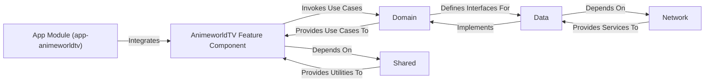

## Details

This subsystem adheres to a modular Android application architecture, separating concerns into distinct components for maintainability, scalability, and reusability.

### AnimeworldTV Feature Component [[Expand]](./AnimeworldTV_Feature_Component.md)
This is the primary feature module for the AnimeworldTV application. It encapsulates the UI (Jetpack Compose), ViewModels, and specific presentation logic tailored for anime consumption on TV platforms. It reuses core business logic from the `Domain` component and common utilities from the `Shared` component, adapting the user experience for a TV environment.

**Related Classes/Methods**:

- `com.otakuworld.animeworldtv.*` (1:1)

### App Module (app-animeworldtv)
This serves as the entry point and orchestrator for the standalone AnimeworldTV application. It is responsible for application-level configuration, dependency graph setup (e.g., using Hilt/Koin), and integrating the `AnimeworldTV Feature Component` to launch the main TV experience.

**Related Classes/Methods**:

- `com.otakuworld.app.animeworldtv.*` (1:1)

### Domain
This component defines the core business logic and use cases for the entire application suite, including anime-related operations. It is technology-agnostic and contains interfaces for repositories, ensuring a clean separation from data implementation details. This component is crucial for enforcing business rules and maintaining consistency across different feature modules.

**Related Classes/Methods**:

- `com.otakuworld.domain.*` (1:1)

### Data
This component is responsible for handling all data operations, including fetching data from remote sources (via `Network`) and local storage, and mapping it to domain-specific entities. It implements the repository interfaces defined in the `Domain` component, acting as the single source of truth for data.

**Related Classes/Methods**:

- `com.otakuworld.data.*` (1:1)

### Network
This component manages all network communication for the application. It defines API service interfaces, handles HTTP requests and responses, and manages data serialization/deserialization. It provides a clean abstraction for data fetching, isolating the rest of the application from network implementation details.

**Related Classes/Methods**:

- `com.otakuworld.network.*` (1:1)

### Shared
This component contains common utilities, extension functions, base classes, and reusable UI components (e.g., custom views, common composables) that are shared across multiple feature modules within the OtakuWorld suite. It promotes code reuse and maintains a consistent look and feel.

**Related Classes/Methods**:

- `com.otakuworld.shared.*` (1:1)

### [FAQ](https://github.com/CodeBoarding/GeneratedOnBoardings/tree/main?tab=readme-ov-file#faq)