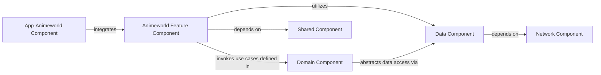

## Details

This detailed analysis focuses on the `Animeworld Feature Component` within the larger OtakuWorld mobile application suite, adhering to the specified Mobile Application Suite (Multi-module Android Project) architectural patterns.

### App-Animeworld Component
This is the main application module for the Animeworld application. It serves as the entry point, orchestrating the integration of the `Animeworld Feature Component` and setting up the necessary dependency graph for the specific Animeworld application.

**Related Classes/Methods**:

- `AppAnimeworldApplication` (1:1)
- `MainActivity` (1:1)

### Animeworld Feature Component [[Expand]](./Animeworld_Feature_Component.md)
Manages all functionalities specific to anime consumption, including UI presentation (browsing, detail views), streaming playback, and user-specific content management (e.g., watchlists). It acts as the primary interface for users interacting with anime content.

**Related Classes/Methods**:

- `ui` (1:1)
- `presentation` (1:1)
- `AnimeworldActivity` (1:1)
- `AnimeworldViewModel` (1:1)

### Domain Component
Contains the core business logic and use cases related to anime. This module defines the rules and operations for anime data manipulation, independent of any specific UI or data source implementation. It orchestrates data flow between the `Animeworld Feature Component` and the `Data Component`.

**Related Classes/Methods**:

- `usecases` (1:1)
- `models` (1:1)
- `repositories.interfaces` (1:1)

### Data Component
Responsible for abstracting data sources (local databases, remote APIs) and providing a clean API for the `Domain Component` (or directly to feature components via repositories) to access and persist anime-related data. It implements the repository pattern.

**Related Classes/Methods**:

- `repositories.impl` (1:1)
- `sources.local` (1:1)
- `sources.remote` (1:1)
- `dtos` (1:1)

### Network Component
Handles all network communication for the application. It encapsulates API client setup, request execution, and response parsing, providing raw data to the `Data Component`.

**Related Classes/Methods**:

- `api` (1:1)
- `clients` (1:1)
- `interceptors` (1:1)

### Shared Component
A common module containing utilities, base classes, extension functions, common UI components (e.g., custom views, themes), and shared data models that are used across multiple feature modules (e.g., `Animeworld`, `Mangaworld`).

**Related Classes/Methods**:

- `utils` (1:1)
- `ui.components` (1:1)
- `models.common` (1:1)

### [FAQ](https://github.com/CodeBoarding/GeneratedOnBoardings/tree/main?tab=readme-ov-file#faq)