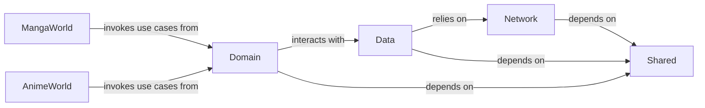

## Details

One paragraph explaining the functionality which is represented by this graph. What the main flow is and what is its purpose.

### Shared
This module provides common utilities, base classes, reusable UI components, and shared resources that are utilized across all other modules in the application suite. It ensures consistency and reduces code duplication.

**Related Classes/Methods**: _None_

### Network
Responsible for all network communication within the application. It handles API requests, responses, and error handling, abstracting the underlying network implementation from other layers.

**Related Classes/Methods**: _None_

### Data
Manages all data sources (local and remote) through the Repository Pattern, acting as the single source of truth for application data. It abstracts data retrieval and storage logic from the domain layer.

**Related Classes/Methods**: _None_

### Domain
Encapsulates the core business logic and use cases of the application. It defines the application's core rules and orchestrates the flow of data between the UI and data layers, remaining independent of specific UI or data source implementations.

**Related Classes/Methods**: _None_

### MangaWorld
A feature module dedicated to Manga-related functionalities. It contains the UI and specific business logic pertinent to displaying and interacting with manga content.

**Related Classes/Methods**: _None_

### AnimeWorld
A feature module dedicated to Anime-related functionalities. It encompasses the UI and specific business logic for displaying and interacting with anime content.

**Related Classes/Methods**: _None_

### [FAQ](https://github.com/CodeBoarding/GeneratedOnBoardings/tree/main?tab=readme-ov-file#faq)