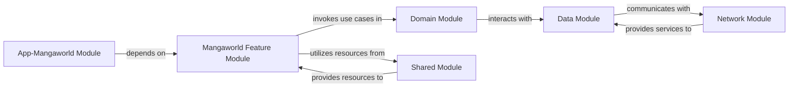

## Details

One paragraph explaining the functionality which is represented by this graph. What the main flow is and what is its purpose.

### App-Mangaworld Module
This is the primary entry point for the Mangaworld application. It is responsible for application-level configurations, dependency graph setup, and launching the main activity or navigation flow specific to the manga feature. It acts as the orchestrator for the entire Mangaworld user experience.

**Related Classes/Methods**: _None_

### Mangaworld Feature Module
Encapsulates all user interface (UI) components built with Jetpack Compose, ViewModels/Presenters, and specific business logic directly related to manga browsing, reading, and content management. It orchestrates the presentation of data to the user and handles user interactions.

**Related Classes/Methods**: _None_

### Domain Module
Contains the core business rules and use cases (interactors) that define the application's behavior, independent of any specific UI framework or data source. It acts as the bridge between the presentation layer (Feature Modules) and the data layer.

**Related Classes/Methods**: _None_

### Data Module
Implements the repository pattern, providing an abstraction layer over various data sources (e.g., local database, remote API). It is responsible for fetching, caching, and managing data, exposing clean interfaces to the Domain Module.

**Related Classes/Methods**: _None_

### Network Module
Dedicated to handling all network-related operations, including API client setup, request/response serialization, and error handling for remote data access. It provides a clean interface for the Data Module to consume.

**Related Classes/Methods**: _None_

### Shared Module
Contains common utilities, reusable UI components (e.g., custom Composables, themes), extension functions, and shared resources (e.g., strings, colors, dimensions) that are utilized across multiple feature modules within the application suite.

**Related Classes/Methods**: _None_

### [FAQ](https://github.com/CodeBoarding/GeneratedOnBoardings/tree/main?tab=readme-ov-file#faq)