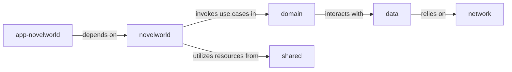

## Details

Architectural analysis of a multi-module project, likely an Android application, identifying logical components and their relationships based on common layered architectural patterns. Concrete source code references are not provided due to limitations in discoverability with available tools and information.

### app-novelworld
Serves as the primary entry point for the Novelworld application. It is responsible for initializing the application's overall graph, including dependency injection, and acts as the host for the `novelworld` feature's user interface.

**Related Classes/Methods**: _None_

### novelworld
Implements the user interface using Jetpack Compose, manages ViewModels/Presenters, and contains specific business logic related to novel features such as browsing, reading, and content management. It orchestrates the presentation of novel data and handles user interactions.

**Related Classes/Methods**: _None_

### domain
Defines the core business rules, novel-specific use cases, and entities. It acts as an orchestrator, mediating between the `novelworld` presentation layer and the `data` layer for all novel-related operations, ensuring business logic is independent of data sources.

**Related Classes/Methods**: _None_

### data
Implements repository interfaces defined in the `domain` module for novel data. It manages various novel data sources (e.g., local database, remote API) and handles data retrieval, caching, and persistence for novel content.

**Related Classes/Methods**: _None_

### network
Provides the network client and API service interfaces specifically for novel-related remote operations. It is responsible for executing network requests and handling responses from remote APIs for novel content.

**Related Classes/Methods**: _None_

### shared
Contains common utilities, extension functions, base classes, and reusable UI components that are shared across multiple feature modules within the OtakuWorld suite, including `novelworld`.

**Related Classes/Methods**: _None_

### [FAQ](https://github.com/CodeBoarding/GeneratedOnBoardings/tree/main?tab=readme-ov-file#faq)