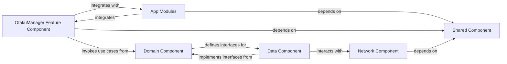

## Details

One paragraph explaining the functionality which is represented by this graph. What the main flow is and what is its purpose.

### OtakuManager Feature Component [[Expand]](./OtakuManager_Feature_Component.md)
This component handles cross-application concerns such as user profiles, synchronization, and shared content management features that span across different media types (manga, anime, novel). It acts as a central hub for user-centric data and preferences, leveraging the Domain and Data components for its underlying business logic and data persistence.

**Related Classes/Methods**: _None_

### App Modules
These modules serve as the entry points for each distinct application within the suite. They are responsible for orchestrating the UI, integrating various feature components, and setting up the application's overall structure and dependencies.

**Related Classes/Methods**: _None_

### Domain Component
Contains the core business logic and use cases of the application suite, independent of any specific framework or data source. It defines the entities, interactors (use cases), and repository interfaces, ensuring that business rules are isolated and testable.

**Related Classes/Methods**: _None_

### Data Component
Responsible for handling data persistence and retrieval from various sources, including local databases and remote APIs. It implements the repository interfaces defined in the Domain component and manages the conversion of data models between different layers.

**Related Classes/Methods**: _None_

### Shared Component
A common module containing utilities, base classes, constants, common UI components, and other cross-cutting concerns that are used by multiple other modules across the application suite.

**Related Classes/Methods**: _None_

### Network Component
Manages all network-related operations, including API calls, request/response handling, and data serialization/deserialization. It provides a clean and abstract interface for other components to interact with remote services.

**Related Classes/Methods**: _None_

### [FAQ](https://github.com/CodeBoarding/GeneratedOnBoardings/tree/main?tab=readme-ov-file#faq)