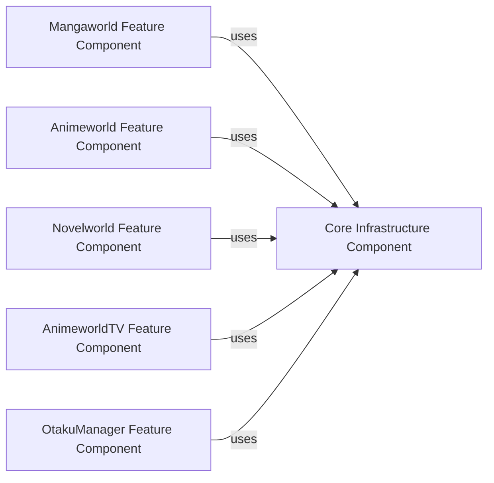

## Details

One paragraph explaining the functionality which is represented by this graph. What the main flow is and what is its purpose.

### Core Infrastructure Component [[Expand]](./Core_Infrastructure_Component.md)
This foundational component provides essential services and shared resources utilized across all application features. It encapsulates common utilities, handles all network communication, manages data sources through the Repository Pattern, and contains the core business logic and use cases. It acts as the central backbone for data flow and business rule enforcement.

**Related Classes/Methods**: _None_

### Mangaworld Feature Component [[Expand]](./Mangaworld_Feature_Component.md)
This component is dedicated to all functionalities related to manga consumption. It includes the UI layer (developed with Jetpack Compose), browsing, reading, and content management specific to manga. It leverages the Core Infrastructure Component for data access and business logic.

**Related Classes/Methods**: _None_

### Animeworld Feature Component [[Expand]](./Animeworld_Feature_Component.md)
This component manages all functionalities for anime consumption, encompassing the UI, browsing, streaming, and content management. It interacts with the Core Infrastructure Component for anime-specific data and business logic.

**Related Classes/Methods**: _None_

### Novelworld Feature Component [[Expand]](./Novelworld_Feature_Component.md)
This component focuses on functionalities for novel consumption, including its dedicated UI, browsing, reading, and content management. It relies on the Core Infrastructure Component for novel-specific data and business logic.

**Related Classes/Methods**: _None_

### AnimeworldTV Feature Component [[Expand]](./AnimeworldTV_Feature_Component.md)
This specialized component provides an interface and functionalities for anime consumption specifically tailored for TV platforms. It reuses core anime logic from the Core Infrastructure Component but adapts the UI and interaction model for the TV environment.

**Related Classes/Methods**: _None_

### OtakuManager Feature Component [[Expand]](./OtakuManager_Feature_Component.md)
This component handles cross-application concerns such as user profiles, synchronization, and shared content management features that span across different media types (manga, anime, novel). It leverages the Core Infrastructure Component for its data and business logic.

**Related Classes/Methods**: _None_

### [FAQ](https://github.com/CodeBoarding/GeneratedOnBoardings/tree/main?tab=readme-ov-file#faq)