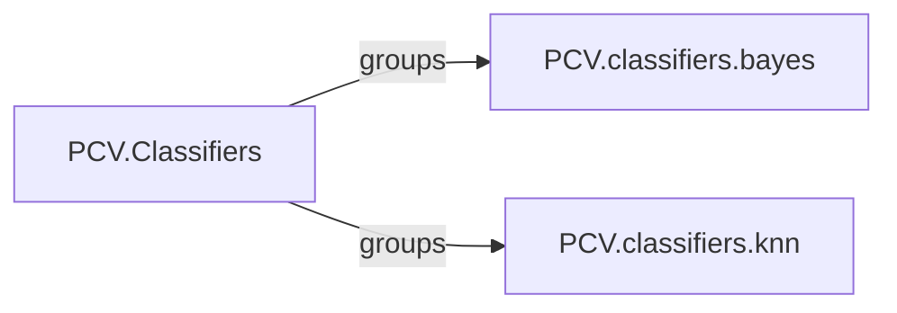

## Details

The `PCV.Classifiers` subsystem is a core part of the PCV library, dedicated to image classification. It is structured as a Python package (`PCV.classifiers`) that acts as a central hub for different classification algorithms. The subsystem currently includes two primary classification methods: `PCV.classifiers.bayes` for statistical Bayesian classification and `PCV.classifiers.knn` for distance-based K-Nearest Neighbors classification. Each of these modules provides specific functions for their respective algorithms, such as `classify` for performing classification and utility functions like `gauss` for Bayesian or `L2dist` for KNN. The `PCV.Classifiers` component, defined by its `__init__.py` file, serves as the entry point and organizational structure, allowing external components to easily access and utilize the various classification functionalities provided within this subsystem. This modular design promotes extensibility, allowing for the addition of new classification algorithms in the future.

### PCV.Classifiers [[Expand]](./PCV_Classifiers.md)
The top-level component representing the `PCV.classifiers` Python package, serving as a namespace and container for various image classification algorithms. Its primary function is to organize and expose different classification methods.

**Related Classes/Methods**:

- <a href="https://github.com/jesolem/PCV/blob/master/PCV/classifiers/__init__.py" target="_blank" rel="noopener noreferrer">`PCV.classifiers`</a>

### PCV.classifiers.bayes
Implements the Bayesian classification algorithm, providing core functions for statistical classification, including `classify` and `gauss` for Gaussian distribution calculations.

**Related Classes/Methods**:

- <a href="https://github.com/jesolem/PCV/blob/master/PCV/classifiers/bayes.py" target="_blank" rel="noopener noreferrer">`PCV.classifiers.bayes`</a>

### PCV.classifiers.knn
Implements the K-Nearest Neighbors (KNN) classification algorithm, offering functions for distance-based classification, including `classify` and `L2dist` for Euclidean distance calculations.

**Related Classes/Methods**:

- <a href="https://github.com/jesolem/PCV/blob/master/PCV/classifiers/knn.py" target="_blank" rel="noopener noreferrer">`PCV.classifiers.knn`</a>

### [FAQ](https://github.com/CodeBoarding/GeneratedOnBoardings/tree/main?tab=readme-ov-file#faq)