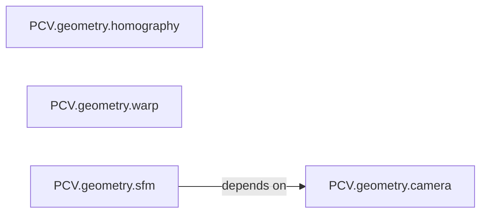

## Details

The PCV.Geometry subsystem is a core component of the PCV computer vision library, dedicated to handling various geometric operations. Its boundaries are defined by the PCV/geometry/ directory, encapsulating modules related to homography, image warping, camera models, and Structure from Motion (SfM). This subsystem provides fundamental building blocks for tasks requiring spatial transformations and 3D reconstruction.

### PCV.geometry.camera
This component is responsible for defining and manipulating camera models. Its primary functions involve calculating the camera's optical center and other intrinsic parameters crucial for projecting 3D points into 2D image planes and vice-versa.

**Related Classes/Methods**:

- <a href="https://github.com/jesolem/PCV/blob/master/PCV/geometry/camera.py" target="_blank" rel="noopener noreferrer">`PCV.geometry.camera:center`</a>
- <a href="https://github.com/jesolem/PCV/blob/master/PCV/geometry/camera.py" target="_blank" rel="noopener noreferrer">`PCV.geometry.camera:factor`</a>

### PCV.geometry.homography
This component focuses on computing and evaluating homographic transformations. It provides functionalities essential for perspective transformations, image alignment, and rectification by mapping points between two planes.

**Related Classes/Methods**:

- <a href="https://github.com/jesolem/PCV/blob/master/PCV/geometry/homography.py" target="_blank" rel="noopener noreferrer">`PCV.geometry.homography:fit`</a>
- <a href="https://github.com/jesolem/PCV/blob/master/PCV/geometry/homography.py" target="_blank" rel="noopener noreferrer">`PCV.geometry.homography:get_error`</a>
- <a href="https://github.com/jesolem/PCV/blob/master/PCV/geometry/homography.py" target="_blank" rel="noopener noreferrer">`PCV.geometry.homography:H_from_points`</a>
- <a href="https://github.com/jesolem/PCV/blob/master/PCV/geometry/homography.py" target="_blank" rel="noopener noreferrer">`PCV.geometry.homography:normalize`</a>

### PCV.geometry.warp
This component handles geometric image transformations, with a specific emphasis on piecewise affine warping. It enables complex image deformations by mapping image regions based on geometric correspondences, often used for image stitching or morphing.

**Related Classes/Methods**:

- <a href="https://github.com/jesolem/PCV/blob/master/PCV/geometry/warp.py" target="_blank" rel="noopener noreferrer">`PCV.geometry.warp:pw_affine`</a>
- <a href="https://github.com/jesolem/PCV/blob/master/PCV/geometry/warp.py" target="_blank" rel="noopener noreferrer">`PCV.geometry.warp:alpha_for_triangle`</a>

### PCV.geometry.sfm
This component implements Structure from Motion (SfM) functionalities. It provides tools for 3D point triangulation, analysis of epipolar geometry, and computation of fundamental and essential matrices, which are critical for reconstructing 3D scenes from multiple 2D images.

**Related Classes/Methods**:

- <a href="https://github.com/jesolem/PCV/blob/master/PCV/geometry/sfm.py" target="_blank" rel="noopener noreferrer">`PCV.geometry.sfm:triangulate`</a>
- <a href="https://github.com/jesolem/PCV/blob/master/PCV/geometry/sfm.py" target="_blank" rel="noopener noreferrer">`PCV.geometry.sfm:plot_epipolar_line`</a>
- <a href="https://github.com/jesolem/PCV/blob/master/PCV/geometry/sfm.py" target="_blank" rel="noopener noreferrer">`PCV.geometry.sfm:compute_P_from_fundamental`</a>
- <a href="https://github.com/jesolem/PCV/blob/master/PCV/geometry/sfm.py" target="_blank" rel="noopener noreferrer">`PCV.geometry.sfm:compute_P_from_essential`</a>
- <a href="https://github.com/jesolem/PCV/blob/master/PCV/geometry/sfm.py" target="_blank" rel="noopener noreferrer">`PCV.geometry.sfm:compute_fundamental_normalized`</a>
- <a href="https://github.com/jesolem/PCV/blob/master/PCV/geometry/sfm.py" target="_blank" rel="noopener noreferrer">`PCV.geometry.sfm:fit`</a>
- <a href="https://github.com/jesolem/PCV/blob/master/PCV/geometry/sfm.py" target="_blank" rel="noopener noreferrer">`PCV.geometry.sfm:triangulate_point`</a>
- <a href="https://github.com/jesolem/PCV/blob/master/PCV/geometry/sfm.py" target="_blank" rel="noopener noreferrer">`PCV.geometry.sfm:compute_epipole`</a>
- <a href="https://github.com/jesolem/PCV/blob/master/PCV/geometry/sfm.py" target="_blank" rel="noopener noreferrer">`PCV.geometry.sfm:skew`</a>
- <a href="https://github.com/jesolem/PCV/blob/master/PCV/geometry/sfm.py" target="_blank" rel="noopener noreferrer">`PCV.geometry.sfm:compute_fundamental`</a>

### [FAQ](https://github.com/CodeBoarding/GeneratedOnBoardings/tree/main?tab=readme-ov-file#faq)