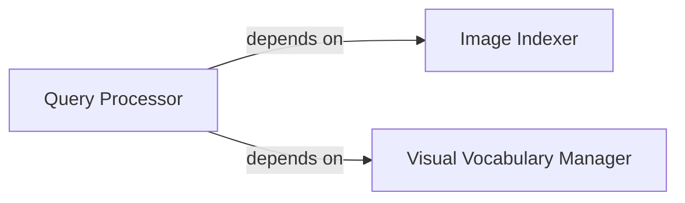

## Details

The PCV.ImageSearch subsystem is primarily contained within the PCV/imagesearch/ directory. Its core functionality is implemented across modules such as imagesearch.py and vocabulary.py, which collectively manage image indexing, content-based retrieval, and visual vocabulary training.

### Image Indexer
Manages the persistent storage and retrieval of image metadata and features. It handles the addition of new images to the index, ensures data integrity (e.g., preventing duplicates), and sets up the necessary database infrastructure. It acts as the data persistence layer for the image search functionality.

**Related Classes/Methods**:

- <a href="https://github.com/jesolem/PCV/blob/master/PCV/imagesearch/imagesearch.py#L40-L62" target="_blank" rel="noopener noreferrer">`PCV.imagesearch.imagesearch.add_to_index`:40-62</a>
- <a href="https://github.com/jesolem/PCV/blob/master/PCV/imagesearch/imagesearch.py#L64-L74" target="_blank" rel="noopener noreferrer">`PCV.imagesearch.imagesearch.create_tables`:64-74</a>
- <a href="https://github.com/jesolem/PCV/blob/master/PCV/imagesearch/imagesearch.py#L21-L32" target="_blank" rel="noopener noreferrer">`PCV.imagesearch.imagesearch.get_id`:21-32</a>
- <a href="https://github.com/jesolem/PCV/blob/master/PCV/imagesearch/imagesearch.py#L34-L38" target="_blank" rel="noopener noreferrer">`PCV.imagesearch.imagesearch.is_indexed`:34-38</a>
- <a href="https://github.com/jesolem/PCV/blob/master/PCV/imagesearch/imagesearch.py#L18-L19" target="_blank" rel="noopener noreferrer">`PCV.imagesearch.imagesearch.db_commit`:18-19</a>

### Query Processor
Encapsulates the core logic for searching and retrieving images based on a query image. It orchestrates the entire search pipeline, including feature extraction from the query, generating candidate matches, and refining the results to identify the most relevant images.

**Related Classes/Methods**:

- <a href="https://github.com/jesolem/PCV/blob/master/PCV/imagesearch/imagesearch.py#L125-L142" target="_blank" rel="noopener noreferrer">`PCV.imagesearch.imagesearch.query`:125-142</a>
- <a href="https://github.com/jesolem/PCV/blob/master/PCV/imagesearch/imagesearch.py#L87-L96" target="_blank" rel="noopener noreferrer">`PCV.imagesearch.imagesearch.get_imhistogram`:87-96</a>
- <a href="https://github.com/jesolem/PCV/blob/master/PCV/imagesearch/imagesearch.py#L105-L123" target="_blank" rel="noopener noreferrer">`PCV.imagesearch.imagesearch.candidates_from_histogram`:105-123</a>
- <a href="https://github.com/jesolem/PCV/blob/master/PCV/imagesearch/imagesearch.py#L98-L103" target="_blank" rel="noopener noreferrer">`PCV.imagesearch.imagesearch.candidates_from_word`:98-103</a>

### Visual Vocabulary Manager
Dedicated to the creation, training, and management of the visual vocabulary. This vocabulary is a critical element for content-based image retrieval, enabling the system to understand and compare image content at a semantic level by mapping image features into a common vocabulary space.

**Related Classes/Methods**:

- <a href="https://github.com/jesolem/PCV/blob/master/PCV/imagesearch/vocabulary.py#L16-L42" target="_blank" rel="noopener noreferrer">`PCV.imagesearch.vocabulary.train`:16-42</a>
- <a href="https://github.com/jesolem/PCV/blob/master/PCV/imagesearch/vocabulary.py#L44-L54" target="_blank" rel="noopener noreferrer">`PCV.imagesearch.vocabulary.project`:44-54</a>

### [FAQ](https://github.com/CodeBoarding/GeneratedOnBoardings/tree/main?tab=readme-ov-file#faq)