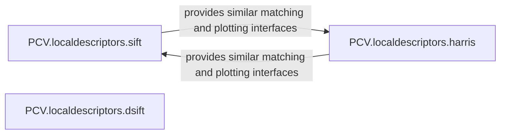

## Details

The PCV.LocalDescriptors subsystem provides functionalities for extracting and matching distinctive local features from images, including SIFT, Harris Corner, and Dense SIFT algorithms.

### PCV.localdescriptors.sift
Implements the Scale-Invariant Feature Transform (SIFT) algorithm. This component handles keypoint detection, SIFT descriptor computation, and feature matching between images. It also includes utilities for visualizing detected features and their matches.

**Related Classes/Methods**:

- <a href="https://github.com/jesolem/PCV/blob/master/PCV/localdescriptors/sift.py" target="_blank" rel="noopener noreferrer">`PCV.localdescriptors.sift:match`</a>
- <a href="https://github.com/jesolem/PCV/blob/master/PCV/localdescriptors/sift.py" target="_blank" rel="noopener noreferrer">`PCV.localdescriptors.sift:match_twosided`</a>
- <a href="https://github.com/jesolem/PCV/blob/master/PCV/localdescriptors/sift.py" target="_blank" rel="noopener noreferrer">`PCV.localdescriptors.sift:plot_features`</a>
- <a href="https://github.com/jesolem/PCV/blob/master/PCV/localdescriptors/sift.py" target="_blank" rel="noopener noreferrer">`PCV.localdescriptors.sift:plot_matches`</a>
- <a href="https://github.com/jesolem/PCV/blob/master/PCV/localdescriptors/sift.py" target="_blank" rel="noopener noreferrer">`PCV.localdescriptors.sift:appendimages`</a>
- <a href="https://github.com/jesolem/PCV/blob/master/PCV/localdescriptors/sift.py" target="_blank" rel="noopener noreferrer">`PCV.localdescriptors.sift:draw_circle`</a>

### PCV.localdescriptors.harris
Implements the Harris Corner Detection algorithm. This component focuses on identifying robust corner features in images, providing methods for feature extraction, matching, and visualization of detected corners.

**Related Classes/Methods**:

- <a href="https://github.com/jesolem/PCV/blob/master/PCV/localdescriptors/harris.py" target="_blank" rel="noopener noreferrer">`PCV.localdescriptors.harris:match`</a>
- <a href="https://github.com/jesolem/PCV/blob/master/PCV/localdescriptors/harris.py" target="_blank" rel="noopener noreferrer">`PCV.localdescriptors.harris:match_twosided`</a>
- <a href="https://github.com/jesolem/PCV/blob/master/PCV/localdescriptors/harris.py" target="_blank" rel="noopener noreferrer">`PCV.localdescriptors.harris:plot_matches`</a>
- <a href="https://github.com/jesolem/PCV/blob/master/PCV/localdescriptors/harris.py" target="_blank" rel="noopener noreferrer">`PCV.localdescriptors.harris:appendimages`</a>

### PCV.localdescriptors.dsift
(Inferred) Provides an implementation of Dense SIFT. This component extracts SIFT descriptors on a regular grid across an image, rather than at sparse keypoints, making it suitable for dense image representation in tasks like classification.

**Related Classes/Methods**:

- <a href="https://github.com/jesolem/PCV/blob/master/PCV/localdescriptors/dsift.py" target="_blank" rel="noopener noreferrer">`PCV.localdescriptors.dsift:extract_dense_descriptors`</a>

### [FAQ](https://github.com/CodeBoarding/GeneratedOnBoardings/tree/main?tab=readme-ov-file#faq)