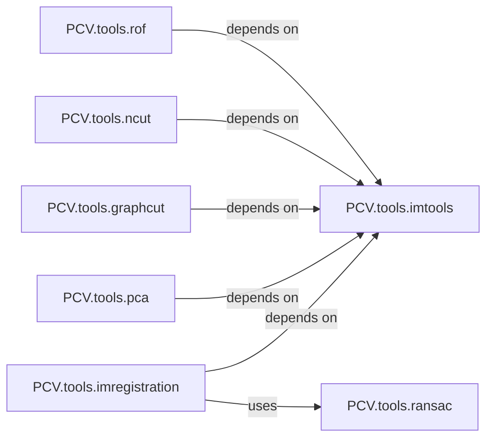

## Details

The PCV.Tools subsystem serves as a comprehensive collection of general utility functions for image processing within the PCV library. It encapsulates various algorithms for fundamental and advanced image manipulation, adhering to the project's modular library and functional decomposition patterns.

### PCV.tools.imtools
Contains a collection of general-purpose image utility functions that provide fundamental operations not specific to a single advanced algorithm. It acts as a foundational utility module.

**Related Classes/Methods**:

- <a href="https://github.com/jesolem/PCV/blob/master/PCV/tools/imtools.py" target="_blank" rel="noopener noreferrer">`PCV.tools.imtools`</a>

### PCV.tools.imregistration
Provides functionalities for aligning images, specifically focusing on rigid transformations. It encapsulates algorithms necessary for image registration.

**Related Classes/Methods**:

- <a href="https://github.com/jesolem/PCV/blob/master/PCV/tools/imregistration.py" target="_blank" rel="noopener noreferrer">`PCV.tools.imregistration`</a>

### PCV.tools.ransac
Implements the RANSAC (Random Sample Consensus) algorithm, a robust method for estimating parameters of a mathematical model from data containing outliers. It offers a generic RANSAC implementation and supporting model structures.

**Related Classes/Methods**:

- <a href="https://github.com/jesolem/PCV/blob/master/PCV/tools/ransac.py" target="_blank" rel="noopener noreferrer">`PCV.tools.ransac`</a>

### PCV.tools.pca
Implements Principal Component Analysis (PCA) for dimensionality reduction, feature extraction, and data transformation.

**Related Classes/Methods**:

- <a href="https://github.com/jesolem/PCV/blob/master/PCV/tools/pca.py" target="_blank" rel="noopener noreferrer">`PCV.tools.pca`</a>

### PCV.tools.graphcut
Provides implementations related to graph cut algorithms, commonly used in image segmentation and energy minimization problems.

**Related Classes/Methods**:

- <a href="https://github.com/jesolem/PCV/blob/master/PCV/tools/graphcut.py" target="_blank" rel="noopener noreferrer">`PCV.tools.graphcut`</a>

### PCV.tools.ncut
Implements the Normalized Cut (NCut) algorithm for image segmentation, a spectral clustering method.

**Related Classes/Methods**:

- <a href="https://github.com/jesolem/PCV/blob/master/PCV/tools/ncut.py" target="_blank" rel="noopener noreferrer">`PCV.tools.ncut`</a>

### PCV.tools.rof
Implements the Rudin-Osher-Fatemi (ROF) model, often used for image denoising and total variation regularization.

**Related Classes/Methods**:

- <a href="https://github.com/jesolem/PCV/blob/master/PCV/tools/rof.py" target="_blank" rel="noopener noreferrer">`PCV.tools.rof`</a>

### [FAQ](https://github.com/CodeBoarding/GeneratedOnBoardings/tree/main?tab=readme-ov-file#faq)