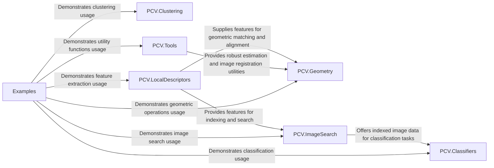

## Details

The PCV library is designed as a comprehensive, modular toolkit for computer vision, enabling users to construct complex image processing pipelines from distinct, reusable components. Its architecture is centered around functional decomposition, with specialized modules for tasks such as feature extraction, geometric transformations, image indexing, and classification. The library emphasizes the flow of processed image data and extracted features between these modules, supported by a robust set of general-purpose tools. This design facilitates clear separation of concerns, promoting both ease of use for individual algorithms and flexibility in combining them for advanced computer vision applications, all demonstrated through practical examples.

### PCV.Classifiers [[Expand]](./PCV_Classifiers.md)
Provides algorithms for image classification (e.g., Bayesian, K-Nearest Neighbors).

**Related Classes/Methods**:

- <a href="https://github.com/jesolem/PCV/blob/master/PCV/classifiers/" target="_blank" rel="noopener noreferrer">`PCV.Classifiers`</a>

### PCV.Clustering
Implements data clustering techniques, such as hierarchical clustering.

**Related Classes/Methods**:

- <a href="https://github.com/jesolem/PCV/blob/master/PCV/clustering/" target="_blank" rel="noopener noreferrer">`PCV.Clustering`</a>

### PCV.Geometry [[Expand]](./PCV_Geometry.md)
Handles geometric operations, including homography, warping, camera models, and Structure from Motion (SfM).

**Related Classes/Methods**:

- <a href="https://github.com/jesolem/PCV/blob/master/PCV/geometry/" target="_blank" rel="noopener noreferrer">`PCV.Geometry`</a>

### PCV.ImageSearch [[Expand]](./PCV_ImageSearch.md)
Manages image indexing, content-based retrieval, and vocabulary training.

**Related Classes/Methods**:

- <a href="https://github.com/jesolem/PCV/blob/master/PCV/imagesearch/" target="_blank" rel="noopener noreferrer">`PCV.ImageSearch`</a>

### PCV.LocalDescriptors [[Expand]](./PCV_LocalDescriptors.md)
Extracts and matches distinctive local features (e.g., SIFT, Harris corners).

**Related Classes/Methods**:

- <a href="https://github.com/jesolem/PCV/blob/master/PCV/localdescriptors/" target="_blank" rel="noopener noreferrer">`PCV.LocalDescriptors`</a>

### PCV.Tools [[Expand]](./PCV_Tools.md)
Offers general utility functions for image processing, including image registration, RANSAC, and PCA.

**Related Classes/Methods**:

- <a href="https://github.com/jesolem/PCV/blob/master/PCV/tools/" target="_blank" rel="noopener noreferrer">`PCV.Tools`</a>

### Examples
Demonstrates practical usage and integration of the PCV library's functionalities.

**Related Classes/Methods**:

- <a href="https://github.com/jesolem/PCV/blob/master/examples/" target="_blank" rel="noopener noreferrer">`Examples`</a>

### [FAQ](https://github.com/CodeBoarding/GeneratedOnBoardings/tree/main?tab=readme-ov-file#faq)