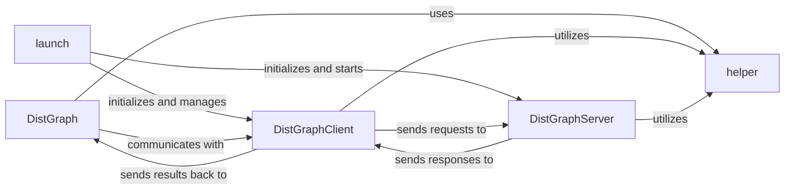

## Details

The `Distributed Graph Engine` subsystem in PGL is designed to enable scalable graph processing by distributing graph data and computation across multiple nodes. It primarily focuses on abstracting the complexities of distributed environments, allowing users to interact with large graphs as if they were local.

### DistGraph
The primary user-facing interface for interacting with the distributed graph. It abstracts the complexities of distributed data access, sampling, and iteration, allowing users to perform graph operations as if on a local graph. It orchestrates data retrieval from the distributed servers.

**Related Classes/Methods**:

- <a href="https://github.com/PaddlePaddle/PGL/blob/main/pgl/distributed/dist_graph.py" target="_blank" rel="noopener noreferrer">`pgl.distributed.DistGraph`</a>

### DistGraphClient
Manages the client-side communication and interaction with the `DistGraphServer` instances. It handles requests for graph data (nodes, edges, features) and distributed operations, ensuring efficient data transfer and synchronization across the distributed environment. It acts as the intermediary for all client-initiated distributed graph operations.

**Related Classes/Methods**:

- <a href="https://github.com/PaddlePaddle/PGL/blob/main/pgl/distributed/dist_graph.py" target="_blank" rel="noopener noreferrer">`pgl.distributed.DistGraphClient`</a>

### DistGraphServer
Manages and serves partitions of the distributed graph data. Each server instance is responsible for a subset of the graph, handling requests from clients, performing local graph operations (e.g., neighbor sampling on its partition), and serving data to `DistGraphClient` instances. It is the backend for distributed graph storage and computation.

**Related Classes/Methods**:

- <a href="https://github.com/PaddlePaddle/PGL/blob/main/pgl/distributed/dist_graph.py" target="_blank" rel="noopener noreferrer">`pgl.distributed.DistGraphServer`</a>

### launch
Orchestrates the setup, initialization, and coordination of the distributed environment. It manages the lifecycle of `DistGraphServer` and `DistGraphClient` processes, ensuring they can discover and communicate with each other. It's the entry point for starting a distributed PGL application.

**Related Classes/Methods**:

- <a href="https://github.com/PaddlePaddle/PGL/blob/main/pgl/distributed/launch.py" target="_blank" rel="noopener noreferrer">`pgl.distributed.launch`</a>

### helper
Provides essential utility functions and configurations for the distributed components. This includes loading distributed configurations, managing graph metadata (like edge types), and other common services required by both client and server parts of the system.

**Related Classes/Methods**:

- <a href="https://github.com/PaddlePaddle/PGL/blob/main/pgl/distributed/helper.py" target="_blank" rel="noopener noreferrer">`pgl.distributed.helper`</a>

### [FAQ](https://github.com/CodeBoarding/GeneratedOnBoardings/tree/main?tab=readme-ov-file#faq)