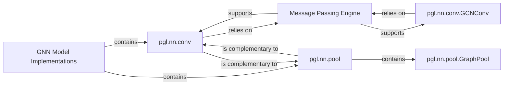

## Details

The `PGL` (Paddle Graph Learning) library's neural network (`nn`) subsystem is designed for building and implementing various Graph Neural Network (GNN) models. At its core, the `Message Passing Engine` provides the fundamental operations for information propagation across graph structures. This engine underpins the `pgl.nn.conv` module, which houses diverse graph convolution operations, and the `pgl.nn.pool` module, responsible for graph pooling techniques. Together, these modules form the `GNN Model Implementations` component, offering a modular and extensible framework for developing advanced GNN architectures. The design emphasizes clear separation of concerns, allowing for flexible combination of convolution and pooling layers to construct complex graph models.

### GNN Model Implementations [[Expand]](./GNN_Model_Implementations.md)
This top-level component provides a comprehensive set of Graph Neural Network architectures and their fundamental layers. It leverages the `Message Passing Engine` for core operations and embodies a modular design, allowing for interchangeable convolution, attention, and pooling layers. It is primarily composed of the `pgl.nn.conv` and `pgl.nn.pool` modules.

**Related Classes/Methods**: _None_

### pgl.nn.conv
This module aggregates various graph convolution operations. Its responsibility is to define how information from a node's neighbors is aggregated and transformed to update the node's representation, directly utilizing the `Message Passing Engine`.

**Related Classes/Methods**:

- <a href="https://github.com/PaddlePaddle/PGL/blob/main/pgl/nn/conv.py#L189-L254" target="_blank" rel="noopener noreferrer">`pgl.nn.conv.GCNConv`:189-254</a>

### pgl.nn.pool
This module provides implementations for graph pooling operations, responsible for reducing graph size or extracting global graph-level features. It's essential for hierarchical graph representations and graph-level prediction tasks.

**Related Classes/Methods**:

- <a href="https://github.com/PaddlePaddle/PGL/blob/main/pgl/nn/pool.py#L30-L62" target="_blank" rel="noopener noreferrer">`pgl.nn.pool.GraphPool`:30-62</a>

### pgl.nn.conv.GCNConv
A concrete implementation of the Graph Convolutional Network layer within `pgl.nn.conv`. It orchestrates the message passing and aggregation logic specific to GCNs, relying on the `Message Passing Engine`.

**Related Classes/Methods**:

- <a href="https://github.com/PaddlePaddle/PGL/blob/main/pgl/nn/conv.py#L189-L254" target="_blank" rel="noopener noreferrer">`pgl.nn.conv.GCNConv`:189-254</a>

### pgl.nn.pool.GraphPool
A foundational class within `pgl.nn.pool` for defining generic graph pooling operations. Specific pooling methods would inherit from or utilize this base class.

**Related Classes/Methods**:

- <a href="https://github.com/PaddlePaddle/PGL/blob/main/pgl/nn/pool.py#L30-L62" target="_blank" rel="noopener noreferrer">`pgl.nn.pool.GraphPool`:30-62</a>

### Message Passing Engine [[Expand]](./Message_Passing_Engine.md)
This component provides the low-level, efficient primitives for message propagation and aggregation across graph nodes and edges. It forms the backbone upon which all GNN layers are built.

**Related Classes/Methods**:

- <a href="https://github.com/PaddlePaddle/PGL/blob/main/pgl/nn/conv.py#L189-L254" target="_blank" rel="noopener noreferrer">`pgl.nn.conv.GCNConv`:189-254</a>

### [FAQ](https://github.com/CodeBoarding/GeneratedOnBoardings/tree/main?tab=readme-ov-file#faq)