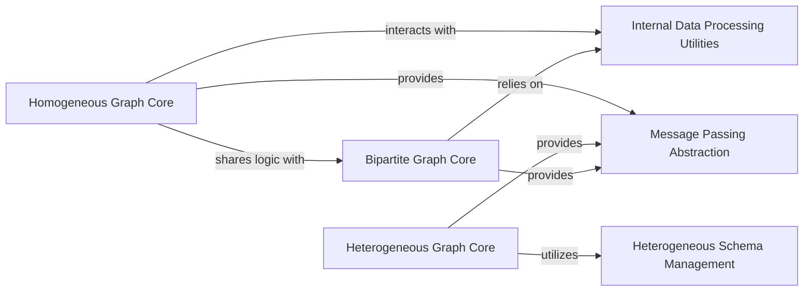

## Details

The PGL graph subsystem is built around a core set of graph representations: `Homogeneous Graph Core`, `Heterogeneous Graph Core`, and `Bipartite Graph Core`. These components are responsible for managing distinct graph structures and their associated data. The `Internal Data Processing Utilities` component provides foundational, low-level data handling and optimization for all graph types, ensuring efficient graph construction and traversal. `Heterogeneous Schema Management` specifically supports the `Heterogeneous Graph Core` by organizing and validating diverse node and edge types. Central to the GNN paradigm, the `Message Passing Abstraction` offers a unified interface for `send` and `recv` operations, allowing models to interact with various graph types consistently. This design emphasizes modularity and extensibility, enabling PGL to support a wide range of graph neural network applications.

### Homogeneous Graph Core
Manages the fundamental data structures for homogeneous graphs, including nodes, edges, and their associated features. It provides methods for graph initialization, data access, neighborhood operations, and basic message passing primitives. This component is foundational for simpler GNN models and serves as a base for understanding more complex graph types.

**Related Classes/Methods**:

- <a href="https://github.com/PaddlePaddle/PGL/blob/main/pgl/graph.py" target="_blank" rel="noopener noreferrer">`pgl.graph.Graph`</a>

### Heterogeneous Graph Core
Manages complex graph structures that contain multiple types of nodes and edges. It handles type-specific data initialization, access, and ensures proper data type conversion across diverse features. This component is crucial for handling real-world, multi-relational datasets, aligning with the "Heterogeneous Graph Support" architectural bias.

**Related Classes/Methods**:

- <a href="https://github.com/PaddlePaddle/PGL/blob/main/pgl/heter_graph.py#L33-L510" target="_blank" rel="noopener noreferrer">`pgl.heter_graph.HeterGraph`:33-510</a>

### Bipartite Graph Core
Manages bipartite graph structures, which are essential for specific GNN applications like recommendation systems or user-item interactions. It provides specialized methods for initialization, data management, and message passing adapted for bipartite relationships.

**Related Classes/Methods**:

- <a href="https://github.com/PaddlePaddle/PGL/blob/main/pgl/bigraph.py#L36-L1507" target="_blank" rel="noopener noreferrer">`pgl.bigraph.BiGraph`:36-1507</a>

### Internal Data Processing Utilities
Provides low-level, efficient utilities for initial graph data setup, validation, and optimized indexing and traversal of edges (e.g., `_process_graph_info`, `adj_src_index`, `adj_dst_index`). These are internal helper components that ensure the performance and correctness of the graph data structures.

**Related Classes/Methods**:

- <a href="https://github.com/PaddlePaddle/PGL/blob/main/pgl/graph.py" target="_blank" rel="noopener noreferrer">`pgl.graph.Graph`</a>
- <a href="https://github.com/PaddlePaddle/PGL/blob/main/pgl/heter_graph.py" target="_blank" rel="noopener noreferrer">`pgl.heter_graph.HeterGraph.__init__`</a>

### Heterogeneous Schema Management
Manages the metadata and schema for different node and edge types within heterogeneous graphs (e.g., `edge_types_info`, `is_tensor`). It ensures data consistency and type safety across diverse features, which is critical for the robustness of `HeterGraph`.

**Related Classes/Methods**:

- <a href="https://github.com/PaddlePaddle/PGL/blob/main/pgl/heter_graph.py#L33-L510" target="_blank" rel="noopener noreferrer">`pgl.heter_graph.HeterGraph`:33-510</a>

### Message Passing Abstraction
Provides a unified `send` and `recv` interface for message passing operations, abstracting away the underlying graph structure (homogeneous, heterogeneous, or bipartite). This is a key "Abstraction Layer" that enables GNN models to operate uniformly across different graph types, embodying the "Message Passing Paradigm."

**Related Classes/Methods**:

- <a href="https://github.com/PaddlePaddle/PGL/blob/main/pgl/message.py" target="_blank" rel="noopener noreferrer">`pgl.message`</a>
- <a href="https://github.com/PaddlePaddle/PGL/blob/main/pgl/graph.py" target="_blank" rel="noopener noreferrer">`pgl.graph.Graph.send`</a>
- <a href="https://github.com/PaddlePaddle/PGL/blob/main/pgl/graph.py" target="_blank" rel="noopener noreferrer">`pgl.graph.Graph.recv`</a>
- <a href="https://github.com/PaddlePaddle/PGL/blob/main/pgl/heter_graph.py" target="_blank" rel="noopener noreferrer">`pgl.heter_graph.HeterGraph.indegree`</a>
- <a href="https://github.com/PaddlePaddle/PGL/blob/main/pgl/heter_graph.py" target="_blank" rel="noopener noreferrer">`pgl.heter_graph.HeterGraph.outdegree`</a>
- <a href="https://github.com/PaddlePaddle/PGL/blob/main/pgl/heter_graph.py" target="_blank" rel="noopener noreferrer">`pgl.heter_graph.HeterGraph.successor`</a>
- <a href="https://github.com/PaddlePaddle/PGL/blob/main/pgl/heter_graph.py" target="_blank" rel="noopener noreferrer">`pgl.heter_graph.HeterGraph.predecessor`</a>

### [FAQ](https://github.com/CodeBoarding/GeneratedOnBoardings/tree/main?tab=readme-ov-file#faq)