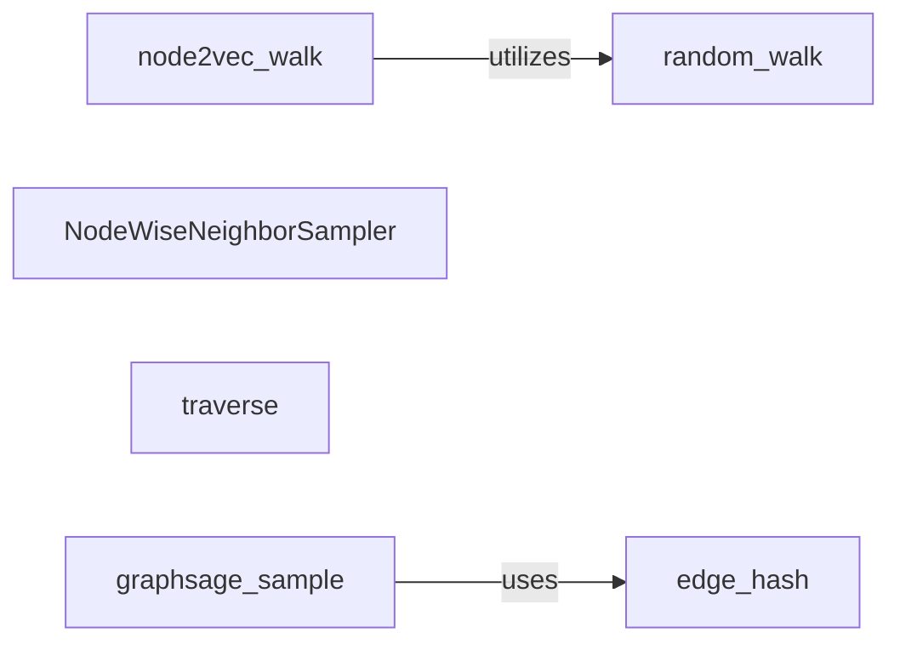

## Details

The `pgl.sampling` subsystem is dedicated to providing various graph traversal and sampling mechanisms essential for graph neural networks. It encompasses algorithms for generating both unbiased (`random_walk`) and biased (`node2vec_walk`) random walks, with `node2vec_walk` leveraging the `random_walk` primitive. Additionally, it offers specialized neighbor sampling techniques for GraphSAGE-like models, including `NodeWiseNeighborSampler` which interfaces with PaddlePaddle's geometric operations, and `graphsage_sample` which utilizes the `edge_hash` utility for efficient edge management. The `traverse` utility provides general data structure iteration capabilities within the subsystem.

### random_walk
Implements the fundamental algorithm for generating unbiased random walks on a graph. This is a core primitive for many graph embedding and sampling techniques.

**Related Classes/Methods**:

- <a href="https://github.com/PaddlePaddle/PGL/blob/main/pgl/sampling/walk.py#L23-L64" target="_blank" rel="noopener noreferrer">`pgl.sampling.walk.random_walk`:23-64</a>

### node2vec_walk
Encapsulates the biased random walk strategy specific to the Node2Vec algorithm, allowing for flexible exploration between BFS-like and DFS-like traversals. It utilizes `random_walk` for the unbiased case.

**Related Classes/Methods**:

- <a href="https://github.com/PaddlePaddle/PGL/blob/main/pgl/sampling/walk.py#L67-L122" target="_blank" rel="noopener noreferrer">`pgl.sampling.walk.node2vec_walk`:67-122</a>

### NodeWiseNeighborSampler
A central component for performing node-wise neighbor sampling, particularly crucial for GraphSAGE-like models, utilizing PaddlePaddle's geometric APIs for efficient neighbor sampling.

**Related Classes/Methods**:

- <a href="https://github.com/PaddlePaddle/PGL/blob/main/pgl/sampling/sage.py#L130-L155" target="_blank" rel="noopener noreferrer">`pgl.sampling.sage.NeighborSampler`:130-155</a>

### traverse
A general utility function for recursively iterating through list or numpy array structures.

**Related Classes/Methods**:

- <a href="https://github.com/PaddlePaddle/PGL/blob/main/pgl/sampling/sage.py#L34-L41" target="_blank" rel="noopener noreferrer">`pgl.sampling.sage.traverse`:34-41</a>

### graphsage_sample
Implements the specific neighbor sampling algorithm used in GraphSAGE, which involves sampling a fixed number of neighbors from each hop.

**Related Classes/Methods**:

- <a href="https://github.com/PaddlePaddle/PGL/blob/main/pgl/sampling/sage.py#L59-L127" target="_blank" rel="noopener noreferrer">`pgl.sampling.sage.graphsage_sample`:59-127</a>

### edge_hash
A utility component responsible for efficient hashing of edges, primarily used during sampling operations to optimize lookup.

**Related Classes/Methods**:

- <a href="https://github.com/PaddlePaddle/PGL/blob/main/pgl/sampling/sage.py#L53-L56" target="_blank" rel="noopener noreferrer">`pgl.sampling.sage.edge_hash`:53-56</a>

### [FAQ](https://github.com/CodeBoarding/GeneratedOnBoardings/tree/main?tab=readme-ov-file#faq)