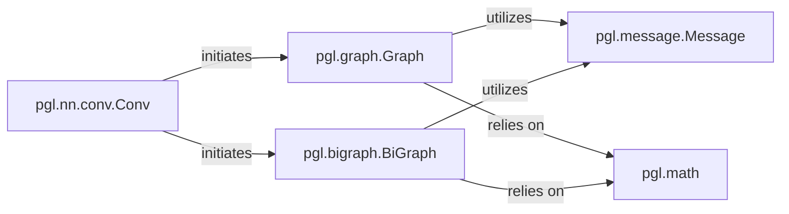

## Details

The `pgl` GNN subsystem is designed around an efficient message passing architecture. At its core, the `pgl.message.Message` component defines the data structure for information exchanged between nodes. Graph structures are managed by `pgl.graph.Graph` for general graphs and `pgl.bigraph.BiGraph` for bipartite graphs, both providing fundamental `send` and `recv` primitives. The `send` operation propagates messages across edges, while the `recv` operation aggregates these messages at target nodes, heavily leveraging the optimized mathematical utilities in `pgl.math` (specifically `segment_sum` and `segment_mean`) for efficient aggregation. Orchestrating this entire process is `pgl.nn.conv.Conv`, an abstract convolutional layer that defines the high-level logic for GNN operations, initiating message passing through the appropriate graph type and utilizing the message and math components to perform graph convolutions. This modular design allows for flexible and efficient implementation of various GNN models.

### pgl.message.Message
Defines the structure and content of messages exchanged during graph operations. It encapsulates the data (e.g., node features, edge features) that is propagated across the graph.

**Related Classes/Methods**:

- <a href="https://github.com/PaddlePaddle/PGL/blob/main/pgl/message.py#L19-L173" target="_blank" rel="noopener noreferrer">`pgl.message.Message`:19-173</a>

### pgl.graph.Graph
Manages general graph data and provides core message sending (`send`) and receiving (`recv`) primitives for standard graph structures. It handles the aggregation of messages at target nodes.

**Related Classes/Methods**: _None_

### pgl.bigraph.BiGraph
Manages bipartite graph data and provides specialized message sending (`send`) and receiving (`recv`) primitives tailored for bipartite graph structures, which are common in heterogeneous graph scenarios.

**Related Classes/Methods**: _None_

### pgl.nn.conv.Conv
An abstract layer that orchestrates the message passing process for graph convolution operations. It defines the high-level logic for how messages are generated, propagated, and aggregated for GNN layers.

**Related Classes/Methods**: _None_

### pgl.math
Provides optimized mathematical utilities for segment-wise operations, specifically `segment_sum` and `segment_mean`, which are crucial for efficient message aggregation during the `recv` phase of message passing in Graph Neural Networks. These functions enable the aggregation of features from multiple source nodes to a single target node based on segment IDs.

**Related Classes/Methods**:

- <a href="https://github.com/PaddlePaddle/PGL/blob/main/pgl/math.py#L19-L46" target="_blank" rel="noopener noreferrer">`pgl.math:segment_sum`:19-46</a>
- <a href="https://github.com/PaddlePaddle/PGL/blob/main/pgl/math.py#L49-L76" target="_blank" rel="noopener noreferrer">`pgl.math:segment_mean`:49-76</a>

### [FAQ](https://github.com/CodeBoarding/GeneratedOnBoardings/tree/main?tab=readme-ov-file#faq)