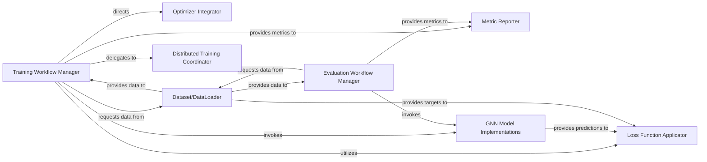

## Details

The PGL (Paddle Graph Learning) subsystem is designed to facilitate the development and deployment of Graph Neural Networks. Its core functionality revolves around a modular architecture that separates concerns such as data handling, model implementation, training orchestration, and evaluation. The system provides specialized components for managing the entire lifecycle of GNN-based applications, from data loading and batching to distributed training and performance reporting. This design promotes flexibility, allowing researchers and developers to easily integrate custom GNN models, loss functions, and optimization strategies while leveraging PGL's robust data and distributed training capabilities.

### Training Workflow Manager
Orchestrates the complete training lifecycle. This involves fetching data, invoking the GNN model for forward computation, calculating the loss, performing backpropagation to compute gradients, and applying the optimizer to update model parameters. It manages the training loop across epochs and mini-batches.

**Related Classes/Methods**:

- <a href="https://github.com/PaddlePaddle/PGL/blob/main/examples/gcn/train.py" target="_blank" rel="noopener noreferrer">`examples/gcn/train.py`</a>

### Evaluation Workflow Manager
Manages the model evaluation process. This includes loading evaluation datasets, performing inference with the trained model, and computing evaluation metrics.

**Related Classes/Methods**:

- <a href="https://github.com/PaddlePaddle/PGL/blob/main/apps/Graph4KG/eval.py" target="_blank" rel="noopener noreferrer">`apps/Graph4KG/eval.py`</a>

### Optimizer Integrator
Provides a bridge between the training workflow and PaddlePaddle's optimization routines, ensuring correct application of parameter updates.

**Related Classes/Methods**:

- <a href="https://github.com/PaddlePaddle/PGL/blob/main/examples/kddcup2022/wpf_baseline/optimization.py" target="_blank" rel="noopener noreferrer">`examples/kddcup2022/wpf_baseline/optimization.py`</a>

### Loss Function Applicator
Computes the loss value based on model predictions and ground truth labels, guiding the optimization process.

**Related Classes/Methods**:

- <a href="https://github.com/PaddlePaddle/PGL/blob/main/apps/Graph4KG/models/loss_func.py" target="_blank" rel="noopener noreferrer">`apps/Graph4KG/models/loss_func.py`</a>

### Metric Reporter
Gathers and presents key performance indicators (e.g., accuracy, F1-score, AUC) from both training and evaluation phases.

**Related Classes/Methods**:

- <a href="https://github.com/PaddlePaddle/PGL/blob/main/examples/kddcup2022/wpf_baseline/metrics.py" target="_blank" rel="noopener noreferrer">`examples/kddcup2022/wpf_baseline/metrics.py`</a>

### GNN Model Implementations [[Expand]](./GNN_Model_Implementations.md)
Contains the core logic for various GNN models, performing forward computation and inference based on graph data.

**Related Classes/Methods**:

- <a href="https://github.com/PaddlePaddle/PGL/blob/main/pgl/nn/conv.py" target="_blank" rel="noopener noreferrer">`pgl/nn/conv.py`</a>

### Dataset/DataLoader
Provides mini-batches of graph data for training and evaluation, abstracting data loading and batching complexities.

**Related Classes/Methods**:

- <a href="https://github.com/PaddlePaddle/PGL/blob/main/pgl/utils/data/dataloader.py" target="_blank" rel="noopener noreferrer">`pgl/utils/data/dataloader.py`</a>

### Distributed Training Coordinator
Orchestrates the distribution of graph data, model parameters, and computations across multiple nodes or devices, leveraging PaddleFleet for scalable training.

**Related Classes/Methods**:

- <a href="https://github.com/PaddlePaddle/PGL/blob/main/pgl/distributed/launch.py" target="_blank" rel="noopener noreferrer">`pgl/distributed/launch.py`</a>

### [FAQ](https://github.com/CodeBoarding/GeneratedOnBoardings/tree/main?tab=readme-ov-file#faq)