```mermaid
graph LR
    Graph_Data_Structures["Graph Data Structures"]
    Data_Loading_Preprocessing["Data Loading & Preprocessing"]
    Graph_Sampling["Graph Sampling"]
    Message_Passing_Engine["Message Passing Engine"]
    GNN_Model_Implementations["GNN Model Implementations"]
    Distributed_Graph_Engine["Distributed Graph Engine"]
    Training_Evaluation_Orchestrator["Training & Evaluation Orchestrator"]
    Data_Loading_Preprocessing -- "Loads and transforms raw data into PGL's internal graph representations." --> Graph_Data_Structures
    Graph_Sampling -- "Provides sampled subgraphs or walks to the data loading pipeline for efficient batching." --> Data_Loading_Preprocessing
    Graph_Data_Structures -- "Supplies graph topology and features for message passing operations." --> Message_Passing_Engine
    Message_Passing_Engine -- "Implements the core message passing and aggregation primitives used by GNN layers." --> GNN_Model_Implementations
    Data_Loading_Preprocessing -- "Feeds processed batches of graph data to the orchestrator for model training and evaluation." --> Training_Evaluation_Orchestrator
    GNN_Model_Implementations -- "Provides the defined GNN models to the orchestrator for training, inference, and evaluation." --> Training_Evaluation_Orchestrator
    Training_Evaluation_Orchestrator -- "Leverages distributed capabilities for large-scale or distributed training and inference." --> Distributed_Graph_Engine
    Distributed_Graph_Engine -- "Manages and provides access to distributed graph data structures, often for large-scale graphs." --> Graph_Data_Structures
    click Graph_Data_Structures href "https://github.com/CodeBoarding/GeneratedOnBoardings/blob/main/PGL/Graph_Data_Structures.md" "Details"
    click Data_Loading_Preprocessing href "https://github.com/CodeBoarding/GeneratedOnBoardings/blob/main/PGL/Data_Loading_Preprocessing.md" "Details"
    click Graph_Sampling href "https://github.com/CodeBoarding/GeneratedOnBoardings/blob/main/PGL/Graph_Sampling.md" "Details"
    click Message_Passing_Engine href "https://github.com/CodeBoarding/GeneratedOnBoardings/blob/main/PGL/Message_Passing_Engine.md" "Details"
    click GNN_Model_Implementations href "https://github.com/CodeBoarding/GeneratedOnBoardings/blob/main/PGL/GNN_Model_Implementations.md" "Details"
    click Distributed_Graph_Engine href "https://github.com/CodeBoarding/GeneratedOnBoardings/blob/main/PGL/Distributed_Graph_Engine.md" "Details"
    click Training_Evaluation_Orchestrator href "https://github.com/CodeBoarding/GeneratedOnBoardings/blob/main/PGL/Training_Evaluation_Orchestrator.md" "Details"
```

## Details

The core architectural components of PGL (Paddle Graph Learning) are designed to facilitate efficient and scalable Graph Neural Network (GNN) development. The system is structured around fundamental graph data representations, robust data loading and preprocessing pipelines, specialized graph sampling techniques, a flexible message passing engine, and a collection of GNN model implementations. For large-scale applications, a distributed graph engine is integrated, all orchestrated by a central training and evaluation component. This modular design promotes clear separation of concerns, allowing for independent development and optimization of each part, which is crucial for both research and production environments.

### Graph Data Structures [[Expand]](./Graph_Data_Structures.md)
Manages the fundamental graph data structures, including nodes, edges, and their associated features, supporting both static and dynamic graph structures.

**Related Classes/Methods**:

- <a href="https://github.com/PaddlePaddle/PGL/blob/main/pgl/graph.py" target="_blank" rel="noopener noreferrer">`pgl.graph.Graph`</a>
- <a href="https://github.com/PaddlePaddle/PGL/blob/main/pgl/heter_graph.py#L33-L510" target="_blank" rel="noopener noreferrer">`pgl.heter_graph.HeterGraph`:33-510</a>
- <a href="https://github.com/PaddlePaddle/PGL/blob/main/pgl/bigraph.py#L36-L1507" target="_blank" rel="noopener noreferrer">`pgl.bigraph.BiGraph`:36-1507</a>

### Data Loading & Preprocessing [[Expand]](./Data_Loading_Preprocessing.md)
Handles the loading, preprocessing, and batching of graph datasets, preparing them for consumption by GNN models.

**Related Classes/Methods**:

- <a href="https://github.com/PaddlePaddle/PGL/blob/main/pgl/utils/data/dataloader.py" target="_blank" rel="noopener noreferrer">`pgl.utils.data.dataloader.Dataloader`</a>

### Graph Sampling [[Expand]](./Graph_Sampling.md)
Provides algorithms for efficiently sampling subgraphs or walks from large graphs, crucial for scalable GNN training and inference.

**Related Classes/Methods**:

- <a href="https://github.com/PaddlePaddle/PGL/blob/main/pgl/sampling/walk.py" target="_blank" rel="noopener noreferrer">`pgl.sampling.walk.Walk`</a>
- <a href="https://github.com/PaddlePaddle/PGL/blob/main/pgl/sampling/sage.py" target="_blank" rel="noopener noreferrer">`pgl.sampling.sage.NodeWiseNeighborSampler`</a>

### Message Passing Engine [[Expand]](./Message_Passing_Engine.md)
Implements the core message passing paradigm, enabling information flow and aggregation across graph nodes and edges, providing low-level mechanisms for GNN operations.

**Related Classes/Methods**:

- <a href="https://github.com/PaddlePaddle/PGL/blob/main/pgl/message.py#L19-L173" target="_blank" rel="noopener noreferrer">`pgl.message.Message`:19-173</a>
- <a href="https://github.com/PaddlePaddle/PGL/blob/main/pgl/nn/conv.py" target="_blank" rel="noopener noreferrer">`pgl.nn.conv.Conv`</a>

### GNN Model Implementations [[Expand]](./GNN_Model_Implementations.md)
Encapsulates various Graph Neural Network architectures and their specific layers (e.g., convolution, attention, pooling), building upon the Message Passing Engine.

**Related Classes/Methods**:

- <a href="https://github.com/PaddlePaddle/PGL/blob/main/pgl/nn/conv.py#L189-L254" target="_blank" rel="noopener noreferrer">`pgl.nn.conv.GCNConv`:189-254</a>
- <a href="https://github.com/PaddlePaddle/PGL/blob/main/pgl/nn/pool.py#L30-L62" target="_blank" rel="noopener noreferrer">`pgl.nn.pool.GraphPool`:30-62</a>

### Distributed Graph Engine [[Expand]](./Distributed_Graph_Engine.md)
Handles functionalities for distributed graph processing, including graph partitioning, distributed graph services, and parameter synchronization, enabling PGL to scale to very large graphs.

**Related Classes/Methods**:

- <a href="https://github.com/PaddlePaddle/PGL/blob/main/pgl/distributed/dist_graph.py" target="_blank" rel="noopener noreferrer">`pgl.distributed.DistGraph`</a>

### Training & Evaluation Orchestrator [[Expand]](./Training_Evaluation_Orchestrator.md)
Coordinates the overall training and evaluation workflows for GNN models, including model initialization, optimization, and metric reporting.

**Related Classes/Methods**:

### [FAQ](https://github.com/CodeBoarding/GeneratedOnBoardings/tree/main?tab=readme-ov-file#faq)