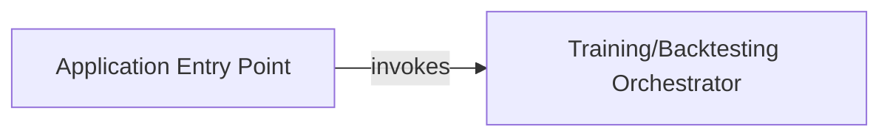

## Details

The `Application Orchestrator` subsystem is the core control unit responsible for initiating and managing the overall execution flow of the PGPortfolio project, from initial setup to the main training or backtesting processes.

### Application Entry Point
This component serves as the initial bootstrap for the entire application. Its core responsibilities include parsing command-line arguments, loading high-level configurations, and performing essential initial setup tasks. It acts as the gateway, preparing the environment before the main operational flow begins.

**Related Classes/Methods**:

- <a href="https://github.com/ZhengyaoJiang/PGPortfolio/blob/master/main.py#L45-L105" target="_blank" rel="noopener noreferrer">`main.main`:45-105</a>

### Training/Backtesting Orchestrator
This is the true central control unit for the deep reinforcement learning framework's operational phase. It orchestrates the entire lifecycle of portfolio management strategies, including data loading, model training, and evaluation. Within the context of an RL framework, this involves managing the interaction between the RL agent, the financial environment, and data pipelines, ensuring the sequential and iterative execution of training or backtesting steps.

**Related Classes/Methods**:

- <a href="https://github.com/ZhengyaoJiang/PGPortfolio/blob/master/pgportfolio/autotrain/training.py#L35-L81" target="_blank" rel="noopener noreferrer">`pgportfolio.autotrain.training.train_all`:35-81</a>

### [FAQ](https://github.com/CodeBoarding/GeneratedOnBoardings/tree/main?tab=readme-ov-file#faq)