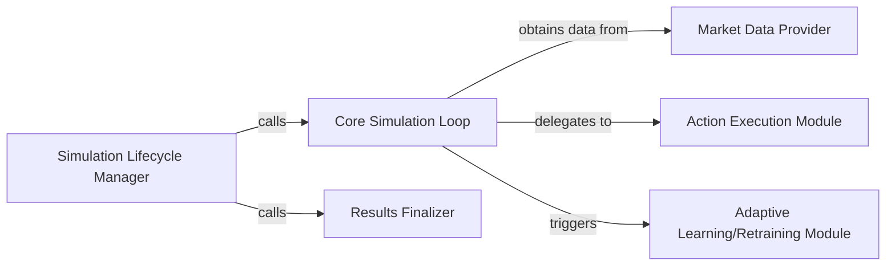

## Details

The `pgportfolio` backtesting subsystem is orchestrated by the Simulation Lifecycle Manager, which initiates and concludes the entire simulation process. At its core, the Core Simulation Loop iteratively processes market data, making trading decisions. This loop relies on the Market Data Provider to supply historical market observations and delegates the actual trade execution to the Action Execution Module. For adaptive strategies, the Adaptive Learning/Retraining Module is triggered within the loop to update the trading agent. Upon completion, the Results Finalizer ensures all simulation outcomes are properly saved and reported. This architecture emphasizes a clear separation of concerns, enabling modular development and maintainability of the backtesting framework.

### Simulation Lifecycle Manager
Orchestrates the entire backtest simulation, from initial setup and configuration to the finalization of results. It initiates the core simulation loop and manages pre- and post-simulation tasks.

**Related Classes/Methods**:

- <a href="https://github.com/ZhengyaoJiang/PGPortfolio/blob/master/pgportfolio/trade/trader.py#L106-L123" target="_blank" rel="noopener noreferrer">`pgportfolio.trade.trader.start_trading`:106-123</a>

### Core Simulation Loop
Implements the iterative core of the backtest. It steps through historical data, applies trading decisions based on the strategy, and continuously updates the simulation state (e.g., portfolio value, holdings, market conditions).

**Related Classes/Methods**:

- <a href="https://github.com/ZhengyaoJiang/PGPortfolio/blob/master/pgportfolio/trade/trader.py#L88-L104" target="_blank" rel="noopener noreferrer">`pgportfolio.trade.trader.__trade_body`:88-104</a>

### Action Execution Module
Executes a single trading decision based on the current strategy (policy) and market conditions within a simulation step. This involves calculating specific trades (buy/sell amounts) and updating portfolio holdings and cash.

**Related Classes/Methods**:

- <a href="https://github.com/ZhengyaoJiang/PGPortfolio/blob/master/pgportfolio/trade/trader.py#L77-L80" target="_blank" rel="noopener noreferrer">`pgportfolio.trade.trader.trade_by_strategy`:77-80</a>

### Adaptive Learning/Retraining Module
Manages the dynamic training or re-training of the trading agent/strategy during the backtest simulation. This enables adaptive or online learning strategies where the model can adjust to new market conditions.

**Related Classes/Methods**:

- <a href="https://github.com/ZhengyaoJiang/PGPortfolio/blob/master/pgportfolio/learn/rollingtrainer.py#L1-L9999" target="_blank" rel="noopener noreferrer">`pgportfolio.learn.rollingtrainer`:1-9999</a>

### Market Data Provider
Provides the necessary historical market data (e.g., price matrices, volume data) to the simulation engine for each step. It effectively serves as the environment's observation space for the trading agent.

**Related Classes/Methods**:

- <a href="https://github.com/ZhengyaoJiang/PGPortfolio/blob/master/pgportfolio/trade/trader.py#L59-L62" target="_blank" rel="noopener noreferrer">`pgportfolio.trade.trader.generate_history_matrix`:59-62</a>

### Results Finalizer
Handles the conclusion of the backtest simulation, including saving the simulation results, generating performance reports, and cleaning up any temporary resources.

**Related Classes/Methods**:

- <a href="https://github.com/ZhengyaoJiang/PGPortfolio/blob/master/pgportfolio/trade/trader.py#L64-L65" target="_blank" rel="noopener noreferrer">`pgportfolio.trade.trader.finish_trading`:64-65</a>
- <a href="https://github.com/ZhengyaoJiang/PGPortfolio/blob/master/pgportfolio/trade/trader.py#L68-L75" target="_blank" rel="noopener noreferrer">`pgportfolio.trade.trader._log_trading_info`:68-75</a>

### [FAQ](https://github.com/CodeBoarding/GeneratedOnBoardings/tree/main?tab=readme-ov-file#faq)