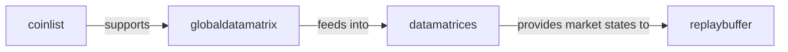

## Details

The `pgportfolio.marketdata` subsystem is designed to manage the entire lifecycle of market data, from initial collection to preparation for machine learning models, specifically for reinforcement learning. It begins with `coinlist` identifying and providing basic cryptocurrency information, which is then utilized by `globaldatamatrix` to establish and maintain a central, raw market data repository. This raw data is systematically transformed by `datamatrices` into structured, model-consumable formats. The processed market states from `datamatrices` are then delivered to `replaybuffer`, which serves as a critical component for storing and managing experiences essential for training reinforcement learning agents. This architecture ensures a clear, unidirectional flow of data, optimizing for clarity and efficiency in the data pipeline.

### coinlist
Responsible for identifying and retrieving basic information, particularly historical volume data, for various cryptocurrencies. It acts as the initial data source for specific coin-related metadata, supporting the broader market data acquisition process.

**Related Classes/Methods**:

- <a href="https://github.com/ZhengyaoJiang/PGPortfolio/blob/master/pgportfolio/marketdata/coinlist.py" target="_blank" rel="noopener noreferrer">`pgportfolio.marketdata.coinlist`</a>

### globaldatamatrix
Manages the acquisition, storage, and updating of raw, global market data. This includes fetching and maintaining a comprehensive matrix of market information (e.g., prices, volumes) across multiple cryptocurrencies over time. It serves as the central repository for raw historical market data.

**Related Classes/Methods**:

- <a href="https://github.com/ZhengyaoJiang/PGPortfolio/blob/master/pgportfolio/marketdata/globaldatamatrix.py" target="_blank" rel="noopener noreferrer">`pgportfolio.marketdata.globaldatamatrix`</a>

### datamatrices
Handles the preprocessing and structuring of raw market data into formats suitable for machine learning models. This involves transforming raw data into structured matrices (e.g., OHLCV, derived features), managing data division (e.g., training/testing splits), and preparing data batches for model training. It acts as the primary interface for models to consume processed market data.

**Related Classes/Methods**:

- <a href="https://github.com/ZhengyaoJiang/PGPortfolio/blob/master/pgportfolio/marketdata/datamatrices.py" target="_blank" rel="noopener noreferrer">`pgportfolio.marketdata.datamatrices`</a>

### replaybuffer
Implements the experience replay mechanism, a fundamental component in Deep Reinforcement Learning. It stores "experiences" (tuples of state, action, reward, next_state, done) gathered from interactions with the environment and provides random batches of these experiences for training the RL agent, decorrelating samples and improving learning stability.

**Related Classes/Methods**:

- <a href="https://github.com/ZhengyaoJiang/PGPortfolio/blob/master/pgportfolio/marketdata/replaybuffer.py" target="_blank" rel="noopener noreferrer">`pgportfolio.marketdata.replaybuffer`</a>

### [FAQ](https://github.com/CodeBoarding/GeneratedOnBoardings/tree/main?tab=readme-ov-file#faq)