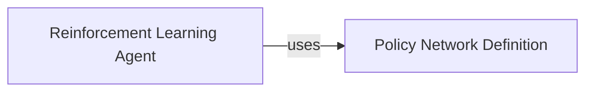

## Details

The Reinforcement Learning Core subsystem is primarily encapsulated within the `pgportfolio.learn` package, specifically focusing on the `nnagent.py` and `network.py` modules. These modules contain the core logic for the reinforcement learning agent and its associated neural network.

### Reinforcement Learning Agent
This component serves as the central orchestrator for the deep reinforcement learning process. It manages the agent's lifecycle, including initialization, the training loop, and the decision-making process based on observed states. It embodies the "learner" aspect of the RL framework, applying the policy to make investment choices.

**Related Classes/Methods**:

- <a href="https://github.com/ZhengyaoJiang/PGPortfolio/blob/master/pgportfolio/learn/nnagent.py#L8-L213" target="_blank" rel="noopener noreferrer">`pgportfolio.learn.nnagent.NNAgent`:8-213</a>
- <a href="https://github.com/ZhengyaoJiang/PGPortfolio/blob/master/pgportfolio/learn/nnagent.py" target="_blank" rel="noopener noreferrer">`pgportfolio.learn.nnagent.NNAgent:__init__`</a>
- <a href="https://github.com/ZhengyaoJiang/PGPortfolio/blob/master/pgportfolio/learn/nnagent.py" target="_blank" rel="noopener noreferrer">`pgportfolio.learn.nnagent.NNAgent:train`</a>
- <a href="https://github.com/ZhengyaoJiang/PGPortfolio/blob/master/pgportfolio/learn/nnagent.py" target="_blank" rel="noopener noreferrer">`pgportfolio.learn.nnagent.NNAgent:__set_loss_function`</a>
- <a href="https://github.com/ZhengyaoJiang/PGPortfolio/blob/master/pgportfolio/learn/nnagent.py" target="_blank" rel="noopener noreferrer">`pgportfolio.learn.nnagent.NNAgent:loss_function6`</a>
- <a href="https://github.com/ZhengyaoJiang/PGPortfolio/blob/master/pgportfolio/learn/nnagent.py" target="_blank" rel="noopener noreferrer">`pgportfolio.learn.nnagent.NNAgent:loss_function7`</a>
- <a href="https://github.com/ZhengyaoJiang/PGPortfolio/blob/master/pgportfolio/learn/nnagent.py" target="_blank" rel="noopener noreferrer">`pgportfolio.learn.nnagent.NNAgent:decide_by_history`</a>

### Policy Network Definition
This component is dedicated to defining, constructing, and managing the deep neural network architecture that serves as the policy network for the `Reinforcement Learning Agent`. It acts as the "model definition" or "architecture builder" within the RL core, providing the structure for the agent's learning capabilities.

**Related Classes/Methods**:

- <a href="https://github.com/ZhengyaoJiang/PGPortfolio/blob/master/pgportfolio/learn/network.py" target="_blank" rel="noopener noreferrer">`pgportfolio.learn.network.Network`</a>
- <a href="https://github.com/ZhengyaoJiang/PGPortfolio/blob/master/pgportfolio/learn/network.py" target="_blank" rel="noopener noreferrer">`pgportfolio.learn.network.Network:__init__`</a>
- <a href="https://github.com/ZhengyaoJiang/PGPortfolio/blob/master/pgportfolio/learn/network.py" target="_blank" rel="noopener noreferrer">`pgportfolio.learn.network.Network:_build_network`</a>
- <a href="https://github.com/ZhengyaoJiang/PGPortfolio/blob/master/pgportfolio/learn/network.py" target="_blank" rel="noopener noreferrer">`pgportfolio.learn.network.Network:add_layer_to_dict`</a>

### [FAQ](https://github.com/CodeBoarding/GeneratedOnBoardings/tree/main?tab=readme-ov-file#faq)