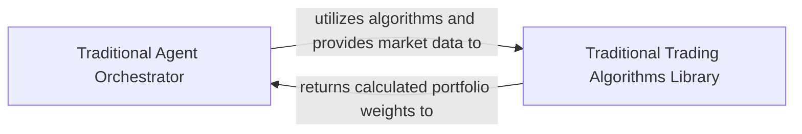

## Details

The `tdagent` subsystem orchestrates traditional trading strategies, with the `Traditional Agent Orchestrator` acting as the core control unit. This orchestrator manages trading sessions, dynamically selecting algorithms from the `Traditional Trading Algorithms Library` and supplying them with historical market data. The `Traditional Trading Algorithms Library`, a repository of diverse classical algorithms, computes portfolio weights based on this data, returning the results to the orchestrator to guide trading decisions. This clear separation of concerns ensures efficient strategy execution and algorithm management.

### Traditional Agent Orchestrator
This component serves as the central control unit for executing traditional trading strategies. It is responsible for initializing and managing the state of a trading session, dynamically selecting and loading specific traditional algorithms, and delegating the decision-making process (i.e., portfolio weight calculation) to the chosen algorithm. It also manages the flow of historical market data to the algorithms.

**Related Classes/Methods**:

- <a href="https://github.com/ZhengyaoJiang/PGPortfolio/blob/master/pgportfolio/tdagent/tdagent.py" target="_blank" rel="noopener noreferrer">`pgportfolio.tdagent.tdagent`</a>

### Traditional Trading Algorithms Library
This component encapsulates a comprehensive collection of classical portfolio management and trading algorithms. Each algorithm within this library is responsible for implementing its specific logic to compute optimal portfolio weights based on provided historical market data. This component acts as a repository of diverse strategies that the Traditional Agent Orchestrator can leverage.

**Related Classes/Methods**:

- <a href="https://github.com/ZhengyaoJiang/PGPortfolio/blob/master/pgportfolio/tdagent/algorithms/anticor1.py" target="_blank" rel="noopener noreferrer">`pgportfolio.tdagent.algorithms.anticor1`</a>
- <a href="https://github.com/ZhengyaoJiang/PGPortfolio/blob/master/pgportfolio/tdagent/algorithms/bcrp.py" target="_blank" rel="noopener noreferrer">`pgportfolio.tdagent.algorithms.bcrp`</a>
- <a href="https://github.com/ZhengyaoJiang/PGPortfolio/blob/master/pgportfolio/tdagent/algorithms/olmar.py" target="_blank" rel="noopener noreferrer">`pgportfolio.tdagent.algorithms.olmar`</a>
- <a href="https://github.com/ZhengyaoJiang/PGPortfolio/blob/master/pgportfolio/tdagent/algorithms/bk.py" target="_blank" rel="noopener noreferrer">`pgportfolio.tdagent.algorithms.bk`</a>
- <a href="https://github.com/ZhengyaoJiang/PGPortfolio/blob/master/pgportfolio/tdagent/algorithms/cornk.py" target="_blank" rel="noopener noreferrer">`pgportfolio.tdagent.algorithms.cornk`</a>
- <a href="https://github.com/ZhengyaoJiang/PGPortfolio/blob/master/pgportfolio/tdagent/algorithms/cornu.py" target="_blank" rel="noopener noreferrer">`pgportfolio.tdagent.algorithms.cornu`</a>
- <a href="https://github.com/ZhengyaoJiang/PGPortfolio/blob/master/pgportfolio/tdagent/algorithms/cwmr_std.py" target="_blank" rel="noopener noreferrer">`pgportfolio.tdagent.algorithms.cwmr_std`</a>
- <a href="https://github.com/ZhengyaoJiang/PGPortfolio/blob/master/pgportfolio/tdagent/algorithms/eg.py" target="_blank" rel="noopener noreferrer">`pgportfolio.tdagent.algorithms.eg`</a>
- <a href="https://github.com/ZhengyaoJiang/PGPortfolio/blob/master/pgportfolio/tdagent/algorithms/ons.py" target="_blank" rel="noopener noreferrer">`pgportfolio.tdagent.algorithms.ons`</a>

### [FAQ](https://github.com/CodeBoarding/GeneratedOnBoardings/tree/main?tab=readme-ov-file#faq)