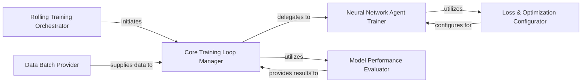

## Details

The training subsystem is designed around a Rolling Training Orchestrator that manages the overall continuous learning process across sequential time windows. For each window, the Core Training Loop Manager takes charge, orchestrating the iterative training cycle. It procures training data from the Data Batch Provider and delegates the core neural network training operations to the Neural Network Agent Trainer. The Neural Network Agent Trainer configures its learning objective through the Loss & Optimization Configurator. Throughout the training, the Model Performance Evaluator assesses the model's effectiveness, providing crucial feedback to the Core Training Loop Manager to guide the learning process. This structured interaction ensures efficient and monitored model training.

### Rolling Training Orchestrator
Manages the overarching rolling training process, iterating through sequential time windows. It orchestrates the training steps for each window, simulating continuous learning or a rolling backtest scenario, crucial for financial time-series applications.

**Related Classes/Methods**:

- <a href="https://github.com/ZhengyaoJiang/PGPortfolio/blob/master/pgportfolio/learn/rollingtrainer.py#L52-L59" target="_blank" rel="noopener noreferrer">`pgportfolio.learn.rollingtrainer.rolling_train`:52-59</a>

### Core Training Loop Manager
Encapsulates the iterative training loop for a single agent within a given time window. Its responsibilities include fetching data, performing model updates, and evaluating performance, serving as the central engine driving the learning process.

**Related Classes/Methods**:

- <a href="https://github.com/ZhengyaoJiang/PGPortfolio/blob/master/pgportfolio/learn/tradertrainer.py#L167-L207" target="_blank" rel="noopener noreferrer">`pgportfolio.learn.tradertrainer.train_net`:167-207</a>

### Neural Network Agent Trainer
Executes the actual training step for the neural network agent, involving the forward pass, loss calculation, and backpropagation for model weight updates. It embodies the core machine learning training logic.

**Related Classes/Methods**:

- <a href="https://github.com/ZhengyaoJiang/PGPortfolio/blob/master/pgportfolio/learn/nnagent.py#L148-L150" target="_blank" rel="noopener noreferrer">`pgportfolio.learn.nnagent.train`:148-150</a>

### Model Performance Evaluator
Assesses the current performance of the trained model or agent based on specific metrics. It provides critical feedback on training progress and model effectiveness, essential for monitoring and hyperparameter tuning.

**Related Classes/Methods**:

- <a href="https://github.com/ZhengyaoJiang/PGPortfolio/blob/master/pgportfolio/learn/tradertrainer.py#L74-L83" target="_blank" rel="noopener noreferrer">`pgportfolio.learn.tradertrainer._evaluate`:74-83</a>

### Data Batch Provider
Provides the next batch of training data (features and labels) to the training engine, ensuring efficient data provisioning, especially for large datasets and mini-batch training.

**Related Classes/Methods**:

- <a href="https://github.com/ZhengyaoJiang/PGPortfolio/blob/master/pgportfolio/marketdata/datamatrices.py#L149-L157" target="_blank" rel="noopener noreferrer">`pgportfolio.marketdata.datamatrices.next_batch`:149-157</a>

### Loss & Optimization Configurator
Configures and sets the specific loss function and handles tensor evaluation for the neural network agent during its training process. This component is crucial for defining the learning objective and adapting to different problem types.

**Related Classes/Methods**:

- <a href="https://github.com/ZhengyaoJiang/PGPortfolio/blob/master/pgportfolio/learn/nnagent.py#L92-L130" target="_blank" rel="noopener noreferrer">`pgportfolio.learn.nnagent.__set_loss_function`:92-130</a>

### [FAQ](https://github.com/CodeBoarding/GeneratedOnBoardings/tree/main?tab=readme-ov-file#faq)