```mermaid
graph LR
    Application_Orchestrator["Application Orchestrator"]
    Configuration_Utilities["Configuration & Utilities"]
    Market_Data_Management["Market Data Management"]
    Reinforcement_Learning_Core["Reinforcement Learning Core"]
    Traditional_Trading_Strategies["Traditional Trading Strategies"]
    Training_Optimization_Engine["Training & Optimization Engine"]
    Backtesting_Simulation_Engine["Backtesting & Simulation Engine"]
    Results_Analysis_Visualization["Results Analysis & Visualization"]
    Application_Orchestrator -- "Initializes & Loads Config" --> Configuration_Utilities
    Application_Orchestrator -- "Triggers Training" --> Training_Optimization_Engine
    Application_Orchestrator -- "Initiates Backtest" --> Backtesting_Simulation_Engine
    Configuration_Utilities -- "Provides Data Settings" --> Market_Data_Management
    Configuration_Utilities -- "Configures Agent" --> Reinforcement_Learning_Core
    Configuration_Utilities -- "Configures Algorithms" --> Traditional_Trading_Strategies
    Market_Data_Management -- "Provides Market Data & Experiences" --> Reinforcement_Learning_Core
    Market_Data_Management -- "Feeds Processed Data" --> Traditional_Trading_Strategies
    Market_Data_Management -- "Provides Training Batches" --> Training_Optimization_Engine
    Reinforcement_Learning_Core -- "Stores Experiences" --> Market_Data_Management
    Reinforcement_Learning_Core -- "Provides Model for Training" --> Training_Optimization_Engine
    Reinforcement_Learning_Core -- "Provides Trading Decisions" --> Backtesting_Simulation_Engine
    Traditional_Trading_Strategies -- "Provides Strategy for Evaluation" --> Training_Optimization_Engine
    Traditional_Trading_Strategies -- "Provides Trading Decisions" --> Backtesting_Simulation_Engine
    Training_Optimization_Engine -- "Triggers Training Steps" --> Reinforcement_Learning_Core
    Training_Optimization_Engine -- "Triggers Strategy Updates" --> Traditional_Trading_Strategies
    Training_Optimization_Engine -- "Provides Trained Model/Strategy" --> Backtesting_Simulation_Engine
    Backtesting_Simulation_Engine -- "Requests Decisions" --> Reinforcement_Learning_Core
    Backtesting_Simulation_Engine -- "Requests Decisions" --> Traditional_Trading_Strategies
    Backtesting_Simulation_Engine -- "Outputs Backtest Results" --> Results_Analysis_Visualization
    click Application_Orchestrator href "https://github.com/CodeBoarding/GeneratedOnBoardings/blob/main/PGPortfolio/Application_Orchestrator.md" "Details"
    click Market_Data_Management href "https://github.com/CodeBoarding/GeneratedOnBoardings/blob/main/PGPortfolio/Market_Data_Management.md" "Details"
    click Reinforcement_Learning_Core href "https://github.com/CodeBoarding/GeneratedOnBoardings/blob/main/PGPortfolio/Reinforcement_Learning_Core.md" "Details"
    click Traditional_Trading_Strategies href "https://github.com/CodeBoarding/GeneratedOnBoardings/blob/main/PGPortfolio/Traditional_Trading_Strategies.md" "Details"
    click Training_Optimization_Engine href "https://github.com/CodeBoarding/GeneratedOnBoardings/blob/main/PGPortfolio/Training_Optimization_Engine.md" "Details"
    click Backtesting_Simulation_Engine href "https://github.com/CodeBoarding/GeneratedOnBoardings/blob/main/PGPortfolio/Backtesting_Simulation_Engine.md" "Details"
```

## Details

The `PGPortfolio` system is designed as a comprehensive deep reinforcement learning platform for cryptocurrency portfolio management. The `Application Orchestrator` acts as the central control, initiating the system by leveraging the `Configuration & Utilities` component to load and preprocess all necessary settings. `Market Data Management` is responsible for acquiring, storing, and providing processed historical market data and experience samples to both the `Reinforcement Learning Core` and `Traditional Trading Strategies`. The `Reinforcement Learning Core` also contributes by storing new experiences back into `Market Data Management`.\n\nThe `Training & Optimization Engine` orchestrates the learning process for both types of agents: it receives models from the `Reinforcement Learning Core` and strategies from `Traditional Trading Strategies`, and in turn, triggers training steps and strategy updates within these components. Once trained, the optimized models and strategies are passed to the `Backtesting & Simulation Engine`. This engine simulates trading on historical data, requesting real-time decisions from both the `Reinforcement Learning Core` and `Traditional Trading Strategies`. Finally, the `Backtesting & Simulation Engine` delivers the performance outcomes to the `Results Analysis & Visualization` component for comprehensive analysis and graphical representation. This structured flow ensures a clear separation of concerns and efficient data progression through the system.

### Application Orchestrator [[Expand]](./Application_Orchestrator.md)
The central control unit that initiates and manages the overall execution flow, from setup to the main training/backtesting process.

**Related Classes/Methods**:

- <a href="https://github.com/ZhengyaoJiang/PGPortfolio/blob/master/main.py#L45-L105" target="_blank" rel="noopener noreferrer">`main.main`:45-105</a>
- <a href="https://github.com/ZhengyaoJiang/PGPortfolio/blob/master/pgportfolio/autotrain/training.py#L35-L81" target="_blank" rel="noopener noreferrer">`pgportfolio.autotrain.training.train_all`:35-81</a>

### Configuration & Utilities
Handles the loading, validation, and preprocessing of all system configurations, ensuring consistent settings across components, and provides general utility functions.

**Related Classes/Methods**:

- <a href="https://github.com/ZhengyaoJiang/PGPortfolio/blob/master/pgportfolio/tools/configprocess.py#L97-L108" target="_blank" rel="noopener noreferrer">`pgportfolio.tools.configprocess.load_config`:97-108</a>
- <a href="https://github.com/ZhengyaoJiang/PGPortfolio/blob/master/pgportfolio/tools/configprocess.py#L16-L21" target="_blank" rel="noopener noreferrer">`pgportfolio.tools.configprocess.preprocess_config`:16-21</a>

### Market Data Management [[Expand]](./Market_Data_Management.md)
Responsible for acquiring, storing, preprocessing, and providing raw and processed historical market data, including managing the experience replay buffer.

**Related Classes/Methods**:

- <a href="https://github.com/ZhengyaoJiang/PGPortfolio/blob/master/pgportfolio/marketdata/coinlist.py" target="_blank" rel="noopener noreferrer">`pgportfolio.marketdata.coinlist.py`</a>
- <a href="https://github.com/ZhengyaoJiang/PGPortfolio/blob/master/pgportfolio/marketdata/globaldatamatrix.py#L43-L47" target="_blank" rel="noopener noreferrer">`pgportfolio.marketdata.globaldatamatrix.get_global_data_matrix`:43-47</a>
- <a href="https://github.com/ZhengyaoJiang/PGPortfolio/blob/master/pgportfolio/marketdata/datamatrices.py#L86-L111" target="_blank" rel="noopener noreferrer">`pgportfolio.marketdata.datamatrices.create_from_config`:86-111</a>
- <a href="https://github.com/ZhengyaoJiang/PGPortfolio/blob/master/pgportfolio/marketdata/datamatrices.py#L149-L157" target="_blank" rel="noopener noreferrer">`pgportfolio.marketdata.datamatrices.next_batch`:149-157</a>
- <a href="https://github.com/ZhengyaoJiang/PGPortfolio/blob/master/pgportfolio/marketdata/replaybuffer.py#L52-L53" target="_blank" rel="noopener noreferrer">`pgportfolio.marketdata.replaybuffer.__init__`:52-53</a>
- <a href="https://github.com/ZhengyaoJiang/PGPortfolio/blob/master/pgportfolio/marketdata/replaybuffer.py#L20-L22" target="_blank" rel="noopener noreferrer">`pgportfolio.marketdata.replaybuffer.append_experience`:20-22</a>
- <a href="https://github.com/ZhengyaoJiang/PGPortfolio/blob/master/pgportfolio/marketdata/replaybuffer.py#L36-L48" target="_blank" rel="noopener noreferrer">`pgportfolio.marketdata.replaybuffer.next_experience_batch`:36-48</a>

### Reinforcement Learning Core [[Expand]](./Reinforcement_Learning_Core.md)
Implements the core deep reinforcement learning logic, including the policy network, loss functions, and decision-making process based on observed states.

**Related Classes/Methods**:

- <a href="https://github.com/ZhengyaoJiang/PGPortfolio/blob/master/pgportfolio/learn/nnagent.py#L9-L46" target="_blank" rel="noopener noreferrer">`pgportfolio.learn.nnagent.__init__`:9-46</a>
- <a href="https://github.com/ZhengyaoJiang/PGPortfolio/blob/master/pgportfolio/learn/nnagent.py#L148-L150" target="_blank" rel="noopener noreferrer">`pgportfolio.learn.nnagent.train`:148-150</a>
- <a href="https://github.com/ZhengyaoJiang/PGPortfolio/blob/master/pgportfolio/learn/nnagent.py#L204-L213" target="_blank" rel="noopener noreferrer">`pgportfolio.learn.nnagent.decide_by_history`:204-213</a>
- <a href="https://github.com/ZhengyaoJiang/PGPortfolio/blob/master/pgportfolio/learn/network.py#L35-L36" target="_blank" rel="noopener noreferrer">`pgportfolio.learn.network.__init__`:35-36</a>
- <a href="https://github.com/ZhengyaoJiang/PGPortfolio/blob/master/pgportfolio/learn/network.py#L44-L151" target="_blank" rel="noopener noreferrer">`pgportfolio.learn.network._build_network`:44-151</a>

### Traditional Trading Strategies [[Expand]](./Traditional_Trading_Strategies.md)
A collection of classical portfolio management and trading algorithms that can be used as baselines or alternative strategies.

**Related Classes/Methods**:

- <a href="https://github.com/ZhengyaoJiang/PGPortfolio/blob/master/pgportfolio/tdagent/algorithms/anticor1.py#L15-L37" target="_blank" rel="noopener noreferrer">`pgportfolio.tdagent.algorithms.anticor1.decide_by_history`:15-37</a>
- <a href="https://github.com/ZhengyaoJiang/PGPortfolio/blob/master/pgportfolio/tdagent/algorithms/bcrp.py#L23-L34" target="_blank" rel="noopener noreferrer">`pgportfolio.tdagent.algorithms.bcrp.decide_by_history`:23-34</a>
- <a href="https://github.com/ZhengyaoJiang/PGPortfolio/blob/master/pgportfolio/tdagent/algorithms/olmar.py#L35-L66" target="_blank" rel="noopener noreferrer">`pgportfolio.tdagent.algorithms.olmar.decide_by_history`:35-66</a>

### Training & Optimization Engine [[Expand]](./Training_Optimization_Engine.md)
Orchestrates the training process for both RL and traditional agents, managing training loops, model updates, and performance evaluation during training.

**Related Classes/Methods**:

- <a href="https://github.com/ZhengyaoJiang/PGPortfolio/blob/master/pgportfolio/learn/tradertrainer.py#L167-L207" target="_blank" rel="noopener noreferrer">`pgportfolio.learn.tradertrainer.train_net`:167-207</a>
- <a href="https://github.com/ZhengyaoJiang/PGPortfolio/blob/master/pgportfolio/learn/rollingtrainer.py#L52-L59" target="_blank" rel="noopener noreferrer">`pgportfolio.learn.rollingtrainer.rolling_train`:52-59</a>

### Backtesting & Simulation Engine [[Expand]](./Backtesting_Simulation_Engine.md)
Simulates the execution of trading strategies on historical market data to evaluate their performance under realistic conditions.

**Related Classes/Methods**:

- <a href="https://github.com/ZhengyaoJiang/PGPortfolio/blob/master/pgportfolio/trade/trader.py#L106-L123" target="_blank" rel="noopener noreferrer">`pgportfolio.trade.trader.start_trading`:106-123</a>
- <a href="https://github.com/ZhengyaoJiang/PGPortfolio/blob/master/pgportfolio/trade/trader.py#L88-L104" target="_blank" rel="noopener noreferrer">`pgportfolio.trade.trader.__trade_body`:88-104</a>

### Results Analysis & Visualization
Processes the output of backtesting and training runs to generate insightful plots and summary tables for performance analysis.

**Related Classes/Methods**:

- <a href="https://github.com/ZhengyaoJiang/PGPortfolio/blob/master/pgportfolio/resultprocess/plot.py#L44-L100" target="_blank" rel="noopener noreferrer">`pgportfolio.resultprocess.plot.plot_backtest`:44-100</a>
- <a href="https://github.com/ZhengyaoJiang/PGPortfolio/blob/master/pgportfolio/resultprocess/table.py" target="_blank" rel="noopener noreferrer">`pgportfolio.resultprocess.table.table_backtest`</a>

### [FAQ](https://github.com/CodeBoarding/GeneratedOnBoardings/tree/main?tab=readme-ov-file#faq)