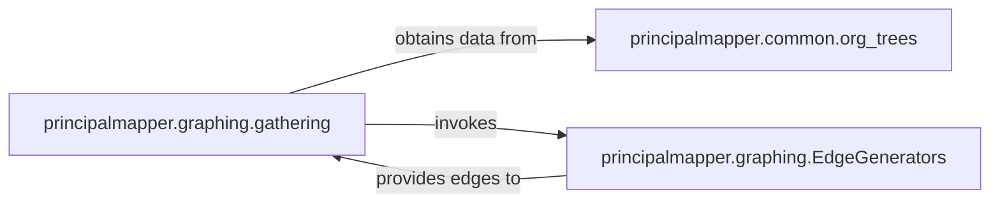

## Details

The `principalmapper` system's core functionality revolves around constructing a comprehensive graph representation of AWS environments. The `principalmapper.graphing.gathering` component serves as the central orchestrator, initiating the data collection process. It first obtains foundational organizational hierarchy data from `principalmapper.common.org_trees`. Subsequently, `gathering` invokes various specialized modules within `principalmapper.graphing.EdgeGenerators` to identify and generate specific types of relationships (edges) between nodes based on AWS service configurations. Finally, these generated edges are provided back to the `gathering` component, which integrates them to form the complete relational graph.

### principalmapper.graphing.gathering
This component acts as the central orchestrator for the entire data ingestion and graph construction process. It initiates data collection from various AWS services, coordinates the integration of this data into the graph, fetches policies, identifies nodes, and updates administrative statuses. It is crucial for managing the overall flow of data transformation into the graph model.

**Related Classes/Methods**:

- <a href="https://github.com/nccgroup/PMapper/blob/master/principalmapper/graphing/gathering.py" target="_blank" rel="noopener noreferrer">`principalmapper.graphing.gathering`</a>

### principalmapper.common.org_trees
This component is responsible for constructing and managing the AWS Organizations tree. It provides the essential hierarchical organizational context, which is critical for understanding account structures, policy inheritance, and cross-account relationships within the generated graph. Its output is a foundational dataset for the `gathering` component.

**Related Classes/Methods**:

- <a href="https://github.com/nccgroup/PMapper/blob/master/principalmapper/common/org_trees.py" target="_blank" rel="noopener noreferrer">`principalmapper.common.org_trees`</a>

### principalmapper.graphing.EdgeGenerators
This is a conceptual grouping of specialized modules, each dedicated to identifying and generating specific types of edges (relationships) within the graph based on configurations and policies of their respective AWS services. These modules act as dedicated processors for different AWS resource types (e.g., IAM, EC2, Lambda), defining the connections and relationships between nodes that form the relational backbone of the graph.

**Related Classes/Methods**:

- <a href="https://github.com/nccgroup/PMapper/blob/master/principalmapper/graphing/iam_edges.py" target="_blank" rel="noopener noreferrer">`principalmapper.graphing.iam_edges`</a>
- <a href="https://github.com/nccgroup/PMapper/blob/master/principalmapper/graphing/ec2_edges.py" target="_blank" rel="noopener noreferrer">`principalmapper.graphing.ec2_edges`</a>
- <a href="https://github.com/nccgroup/PMapper/blob/master/principalmapper/graphing/lambda_edges.py" target="_blank" rel="noopener noreferrer">`principalmapper.graphing.lambda_edges`</a>
- <a href="https://github.com/nccgroup/PMapper/blob/master/principalmapper/graphing/cross_account_edges.py" target="_blank" rel="noopener noreferrer">`principalmapper.graphing.cross_account_edges`</a>
- <a href="https://github.com/nccgroup/PMapper/blob/master/principalmapper/graphing/autoscaling_edges.py" target="_blank" rel="noopener noreferrer">`principalmapper.graphing.autoscaling_edges`</a>
- <a href="https://github.com/nccgroup/PMapper/blob/master/principalmapper/graphing/cloudformation_edges.py" target="_blank" rel="noopener noreferrer">`principalmapper.graphing.cloudformation_edges`</a>
- <a href="https://github.com/nccgroup/PMapper/blob/master/principalmapper/graphing/codebuild_edges.py" target="_blank" rel="noopener noreferrer">`principalmapper.graphing.codebuild_edges`</a>
- <a href="https://github.com/nccgroup/PMapper/blob/master/principalmapper/graphing/sagemaker_edges.py" target="_blank" rel="noopener noreferrer">`principalmapper.graphing.sagemaker_edges`</a>
- <a href="https://github.com/nccgroup/PMapper/blob/master/principalmapper/graphing/ssm_edges.py" target="_blank" rel="noopener noreferrer">`principalmapper.graphing.ssm_edges`</a>
- <a href="https://github.com/nccgroup/PMapper/blob/master/principalmapper/graphing/sts_edges.py" target="_blank" rel="noopener noreferrer">`principalmapper.graphing.sts_edges`</a>

### [FAQ](https://github.com/CodeBoarding/GeneratedOnBoardings/tree/main?tab=readme-ov-file#faq)