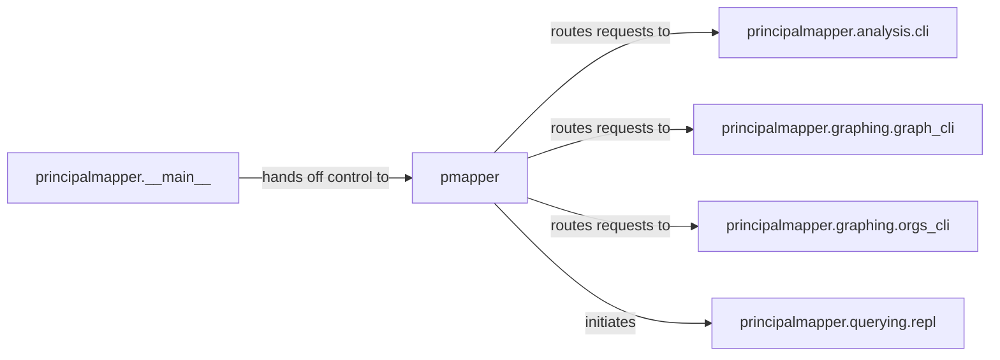

## Details

The CLI & Orchestration Layer subsystem encompasses the core entry points and command dispatching mechanisms of the PMapper application.

### principalmapper.__main__
The absolute entry point for the PMapper application when executed as a script. It initializes the application environment and delegates control to the primary orchestrator. This component is fundamental as it's the first point of execution for the CLI tool.

**Related Classes/Methods**:

- <a href="https://github.com/nccgroup/PMapper/blob/master/principalmapper/__main__.py" target="_blank" rel="noopener noreferrer">`principalmapper.__main__`</a>

### pmapper
Acts as the central command dispatcher. It receives parsed arguments (likely from `__main__`) and determines which specific CLI sub-component (e.g., `analysis.cli`, `graph_cli`, `orgs_cli`, or `repl`) should handle the request. It embodies the overall application logic flow and is crucial for orchestrating user commands.

**Related Classes/Methods**:

- <a href="https://github.com/nccgroup/PMapper/blob/master/pmapper.py" target="_blank" rel="noopener noreferrer">`pmapper`</a>

### principalmapper.analysis.cli
Specializes in parsing and handling command-line arguments specifically related to analysis functionalities (e.g., policy simulation, risk assessment). It translates CLI commands into calls to the underlying analysis engine, serving as the CLI interface for a specific functional area.

**Related Classes/Methods**:

- <a href="https://github.com/nccgroup/PMapper/blob/master/principalmapper/analysis/cli.py" target="_blank" rel="noopener noreferrer">`principalmapper.analysis.cli`</a>

### principalmapper.graphing.graph_cli
Parses and handles command-line arguments for general graph-related operations, such as generating visualizations or performing generic graph queries. This component provides the CLI interface for broad graph functionalities.

**Related Classes/Methods**:

- <a href="https://github.com/nccgroup/PMapper/blob/master/principalmapper/graphing/graph_cli.py" target="_blank" rel="noopener noreferrer">`principalmapper.graphing.graph_cli`</a>

### principalmapper.graphing.orgs_cli
Specializes in parsing and handling command-line arguments for AWS Organizations-specific graph operations, including traversing and mapping OU structures. This component provides a focused CLI interface for a specific domain within graph operations.

**Related Classes/Methods**:

- <a href="https://github.com/nccgroup/PMapper/blob/master/principalmapper/graphing/orgs_cli.py" target="_blank" rel="noopener noreferrer">`principalmapper.graphing.orgs_cli`</a>

### principalmapper.querying.repl
Provides a Read-Eval-Print Loop (REPL) for interactive querying of the PMapper's data model. It manages the session, parses user input, executes queries, and displays results. This component is crucial for interactive user experience, aligning with the "CLI Tool" aspect.

**Related Classes/Methods**:

- <a href="https://github.com/nccgroup/PMapper/blob/master/principalmapper/querying/repl.py" target="_blank" rel="noopener noreferrer">`principalmapper.querying.repl`</a>

### [FAQ](https://github.com/CodeBoarding/GeneratedOnBoardings/tree/main?tab=readme-ov-file#faq)