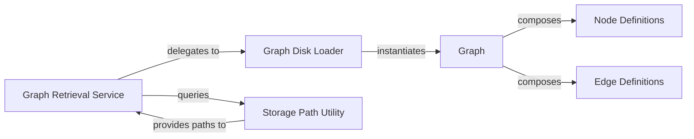

## Details

The Graph Core & Persistence subsystem is responsible for managing the in-memory representation of the IAM graph and handling its persistence, including loading from and saving to various storage formats. It provides the fundamental data structures and operations for graph manipulation.

### Graph
The primary in-memory data structure representing the IAM graph, composed of nodes and edges. This is the core data model for all graph operations.

**Related Classes/Methods**:

- <a href="https://github.com/nccgroup/PMapper/blob/master/principalmapper/common/graphs.py#L38-L219" target="_blank" rel="noopener noreferrer">`principalmapper.common.graphs.Graph`:38-219</a>

### Node Definitions
Defines the abstract and concrete classes for different types of IAM entities (e.g., User, Role, Policy) that serve as nodes within the Graph. This component ensures type safety and proper representation of IAM principals.

**Related Classes/Methods**:

- <a href="https://github.com/nccgroup/PMapper/blob/master/principalmapper/common/nodes.py" target="_blank" rel="noopener noreferrer">`principalmapper.common.nodes`</a>

### Edge Definitions
Defines the abstract and concrete classes for relationships between IAM entities (e.g., AssumesRole, HasPolicy) that serve as edges within the Graph. This component captures the relational aspects of IAM policies.

**Related Classes/Methods**:

- <a href="https://github.com/nccgroup/PMapper/blob/master/principalmapper/common/edges.py" target="_blank" rel="noopener noreferrer">`principalmapper.common.edges`</a>

### Graph Disk Loader
A utility function responsible for deserializing raw graph data from persistent storage (e.g., JSON files) into an in-memory Graph object. It handles the low-level parsing and reconstruction of the graph.

**Related Classes/Methods**:

- <a href="https://github.com/nccgroup/PMapper/blob/master/principalmapper/common/graphs.py#L110-L219" target="_blank" rel="noopener noreferrer">`principalmapper.common.graphs.create_graph_from_local_disk`:110-219</a>

### Graph Retrieval Service
A high-level interface that orchestrates the retrieval of an IAM graph, abstracting the underlying loading mechanisms and providing a consistent access point for other components. It acts as a facade for graph loading.

**Related Classes/Methods**:

- <a href="https://github.com/nccgroup/PMapper/blob/master/principalmapper/graphing/graph_actions.py#L68-L83" target="_blank" rel="noopener noreferrer">`principalmapper.graphing.graph_actions.get_existing_graph`:68-83</a>
- <a href="https://github.com/nccgroup/PMapper/blob/master/principalmapper/graphing/graph_actions.py#L60-L65" target="_blank" rel="noopener noreferrer">`principalmapper.graphing.graph_actions.get_graph_from_disk`:60-65</a>

### Storage Path Utility
A utility responsible for managing and providing standardized file system paths where graph data is stored and retrieved, ensuring consistency across the application's persistence operations.

**Related Classes/Methods**:

- <a href="https://github.com/nccgroup/PMapper/blob/master/principalmapper/util/storage.py#L58-L60" target="_blank" rel="noopener noreferrer">`principalmapper.util.storage.get_default_graph_path`:58-60</a>
- <a href="https://github.com/nccgroup/PMapper/blob/master/principalmapper/util/storage.py#L23-L55" target="_blank" rel="noopener noreferrer">`principalmapper.util.storage.get_storage_root`:23-55</a>

### [FAQ](https://github.com/CodeBoarding/GeneratedOnBoardings/tree/main?tab=readme-ov-file#faq)