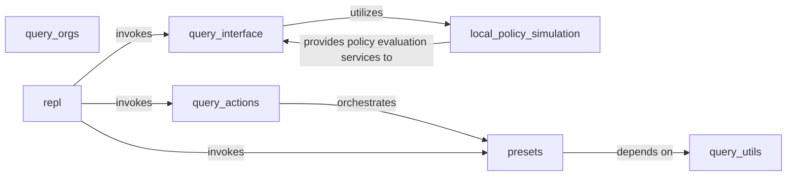

## Details

The `Graph Query & Analysis Interface` subsystem is primarily encapsulated within the `principalmapper.querying` package. This subsystem provides the core functionality for interacting with the IAM graph, performing authorization checks, and executing predefined analysis patterns.

### query_interface
Serves as the primary entry point for authorization checks within the system. It provides core functions like `search_authorization_for` and `local_check_authorization_handling_mfa`, and is responsible for preparing the necessary condition contexts for policy evaluation.

**Related Classes/Methods**:

- <a href="https://github.com/nccgroup/PMapper/blob/master/principalmapper/querying/query_interface.py" target="_blank" rel="noopener noreferrer">`principalmapper.querying.query_interface`</a>

### local_policy_simulation
The core engine for evaluating IAM policies. It assesses policies against specified actions, resources, and principals, taking into account various conditions to determine authorization outcomes.

**Related Classes/Methods**:

- <a href="https://github.com/nccgroup/PMapper/blob/master/principalmapper/querying/local_policy_simulation.py" target="_blank" rel="noopener noreferrer">`principalmapper.querying.local_policy_simulation`</a>

### query_actions
Manages the overall flow for handling user queries. This includes dispatching requests to pre-defined query patterns (`presets`) and providing help information for query construction. It acts as a command dispatcher for the query interface.

**Related Classes/Methods**:

- <a href="https://github.com/nccgroup/PMapper/blob/master/principalmapper/querying/query_actions.py" target="_blank" rel="noopener noreferrer">`principalmapper.querying.query_actions`</a>

### query_orgs
Specializes in querying and processing organizational data, particularly Service Control Policies (SCPs). It includes functionality for recursive traversal of organizational units to apply policy analysis.

**Related Classes/Methods**:

- <a href="https://github.com/nccgroup/PMapper/blob/master/principalmapper/querying/query_orgs.py" target="_blank" rel="noopener noreferrer">`principalmapper.querying.query_orgs`</a>

### query_utils
Provides common utility functions essential for graph traversal and connectivity analysis. Examples include `get_search_list` for pathfinding and `is_connected` for determining graph connectivity.

**Related Classes/Methods**:

- <a href="https://github.com/nccgroup/PMapper/blob/master/principalmapper/querying/query_utils.py" target="_blank" rel="noopener noreferrer">`principalmapper.querying.query_utils`</a>

### presets
Contains modules that implement specific, pre-defined queries or analysis patterns (e.g., `clusters`, `connected`, `privesc`). These presets simplify complex security analysis tasks by encapsulating common graph traversal and analysis logic.

**Related Classes/Methods**:

- <a href="https://github.com/nccgroup/PMapper/blob/master/principalmapper/querying/presets" target="_blank" rel="noopener noreferrer">`principalmapper.querying.presets`</a>

### repl
Implements a Read-Eval-Print Loop (REPL) for interactive querying and analysis. This component serves as the direct command-line interface (CLI) for users to interact with the IAM graph and execute queries or analysis patterns.

**Related Classes/Methods**:

- <a href="https://github.com/nccgroup/PMapper/blob/master/principalmapper/querying/repl.py" target="_blank" rel="noopener noreferrer">`principalmapper.querying.repl`</a>

### [FAQ](https://github.com/CodeBoarding/GeneratedOnBoardings/tree/main?tab=readme-ov-file#faq)