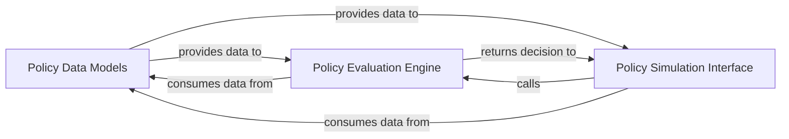

## Details

This subsystem is the analytical core of `PMapper`, responsible for accurately simulating AWS IAM policy evaluation to determine authorization decisions. It provides the foundational capability for security analysis by interpreting and applying IAM policy logic.

### Policy Data Models
This component defines the foundational data structures and models for representing AWS IAM policies, statements, principals, actions, resources, and conditions. It ensures consistency and type safety for all policy-related data consumed and processed throughout the simulation engine. Its fundamental importance lies in providing a standardized, robust schema for all policy-related information.

**Related Classes/Methods**:

- <a href="https://github.com/nccgroup/PMapper/blob/master/principalmapper/common/policies.py" target="_blank" rel="noopener noreferrer">`principalmapper.common.policies`</a>

### Policy Evaluation Engine
This is the granular core of the policy simulation. It contains the detailed logic for evaluating individual AWS IAM policy statements against a given principal, action, resource, and conditions. It handles complex aspects like condition key matching, pattern expansion for actions and resources, and determining the final authorization decision (allow/deny). Its importance stems from its direct implementation of the complex IAM policy evaluation rules.

**Related Classes/Methods**:

- <a href="https://github.com/nccgroup/PMapper/blob/master/principalmapper/querying/local_policy_simulation.py" target="_blank" rel="noopener noreferrer">`principalmapper.querying.local_policy_simulation`</a>

### Policy Simulation Interface
This component serves as the public API or facade for interacting with the policy simulation engine. It prepares the necessary context for policy evaluation (e.g., inferring condition keys, handling MFA-aware checks) and orchestrates calls to the `Policy Evaluation Engine`. It provides high-level functions for initiating authorization queries, abstracting the underlying complexity. Its importance lies in providing a clean, accessible entry point to the simulation capabilities for other parts of the system.

**Related Classes/Methods**:

- <a href="https://github.com/nccgroup/PMapper/blob/master/principalmapper/querying/query_interface.py" target="_blank" rel="noopener noreferrer">`principalmapper.querying.query_interface`</a>

### [FAQ](https://github.com/CodeBoarding/GeneratedOnBoardings/tree/main?tab=readme-ov-file#faq)