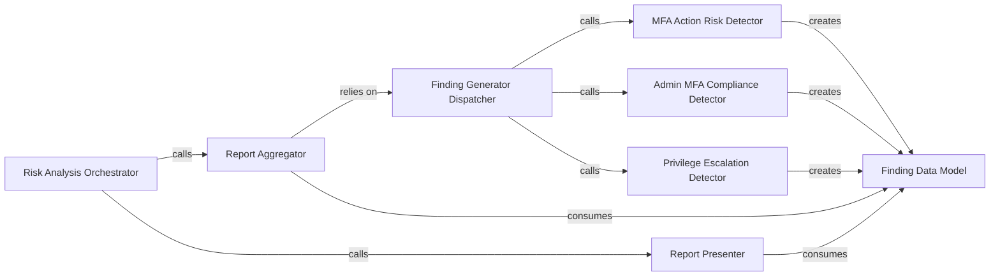

## Details

The `Risk Analysis & Reporting` subsystem is responsible for identifying common AWS IAM security risks and misconfigurations, leveraging the graph structure and policy simulation capabilities to detect vulnerabilities, and generating structured findings and reports.

### Risk Analysis Orchestrator
Serves as the primary entry point for initiating the risk analysis and report generation process. It orchestrates the flow from finding detection to report presentation.

**Related Classes/Methods**:

- <a href="https://github.com/nccgroup/PMapper/blob/master/principalmapper/analysis/find_risks.py#L43-L51" target="_blank" rel="noopener noreferrer">`gen_findings_and_print`:43-51</a>

### Finding Generator Dispatcher
Acts as a central dispatcher, invoking various specialized functions to detect different types of security risks within the IAM graph.

**Related Classes/Methods**:

- <a href="https://github.com/nccgroup/PMapper/blob/master/principalmapper/analysis/find_risks.py#L67-L79" target="_blank" rel="noopener noreferrer">`gen_all_findings`:67-79</a>

### Report Aggregator
Collects and aggregates all identified security findings into a comprehensive report structure.

**Related Classes/Methods**:

- <a href="https://github.com/nccgroup/PMapper/blob/master/principalmapper/analysis/find_risks.py#L54-L64" target="_blank" rel="noopener noreferrer">`gen_report`:54-64</a>

### Report Presenter
Handles the final formatting and display of the generated risk report to the user, typically via the command-line interface.

**Related Classes/Methods**:

- <a href="https://github.com/nccgroup/PMapper/blob/master/principalmapper/analysis/find_risks.py#L519-L548" target="_blank" rel="noopener noreferrer">`print_report`:519-548</a>

### Finding Data Model
Defines the structured data model for individual security findings, encapsulating details such as the type of risk, affected entities, and severity.

**Related Classes/Methods**:

- <a href="https://github.com/nccgroup/PMapper/blob/master/principalmapper/analysis/finding.py#L19-L37" target="_blank" rel="noopener noreferrer">`finding`:19-37</a>

### MFA Action Risk Detector
Identifies security risks specifically related to Multi-Factor Authentication (MFA) actions and configurations.

**Related Classes/Methods**:

- <a href="https://github.com/nccgroup/PMapper/blob/master/principalmapper/analysis/find_risks.py#L128-L166" target="_blank" rel="noopener noreferrer">`gen_mfa_actions_findings`:128-166</a>

### Admin MFA Compliance Detector
Detects administrative users within the IAM graph who do not have Multi-Factor Authentication (MFA) enabled, highlighting a common security misconfiguration.

**Related Classes/Methods**:

- <a href="https://github.com/nccgroup/PMapper/blob/master/principalmapper/analysis/find_risks.py#L410-L448" target="_blank" rel="noopener noreferrer">`gen_admin_users_without_mfa_finding`:410-448</a>

### Privilege Escalation Detector
Analyzes the IAM graph to identify potential paths through which an entity could escalate its privileges beyond its intended scope.

**Related Classes/Methods**:

- <a href="https://github.com/nccgroup/PMapper/blob/master/principalmapper/analysis/find_risks.py#L82-L125" target="_blank" rel="noopener noreferrer">`gen_privesc_findings`:82-125</a>

### [FAQ](https://github.com/CodeBoarding/GeneratedOnBoardings/tree/main?tab=readme-ov-file#faq)